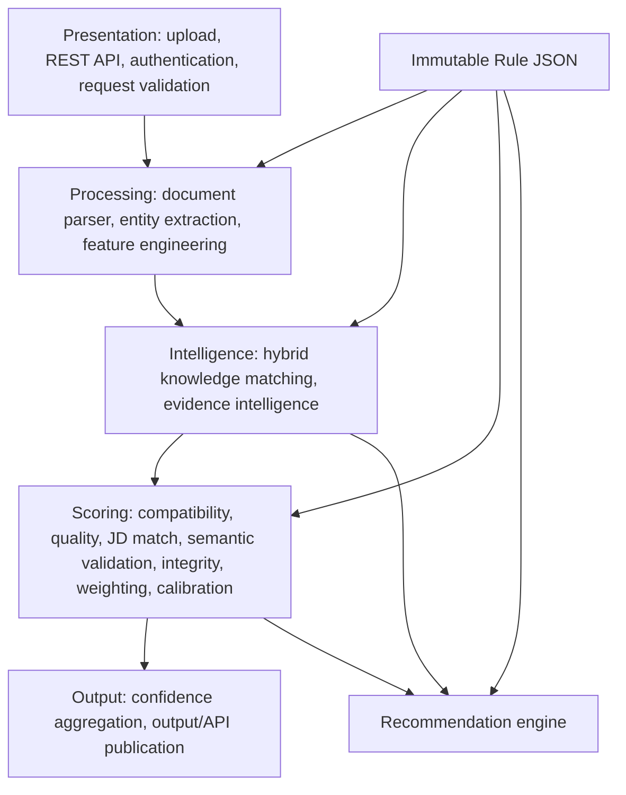
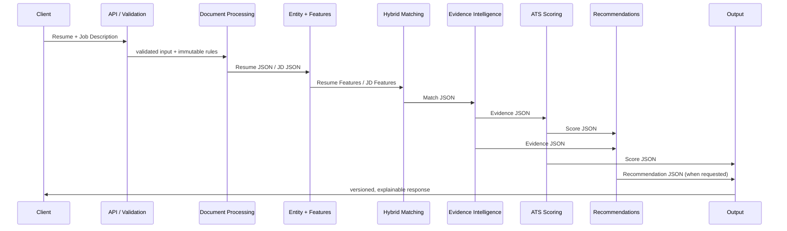
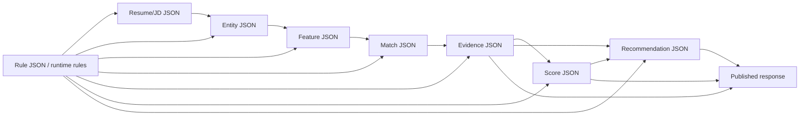

# ATS Resume Intelligence Engine — Architecture Analysis

## Scope and authority

This analysis reflects the repository handbook as supplied. The Resume + JD handbook is the system design authority; `docs/ats_resume_only_score_engine.md` defines a separately scoped Resume Only v3.2 mode. No implementation exists in this repository. Consequently, package names, class names, dependency-injection wiring, logging backend, and deployment topology below are *required implementation boundaries*, not implemented artifacts or new business rules.

## Overall and layered architecture

The system evaluates a Resume against a Job Description deterministically and produces explainable, evidence-backed, versioned score and recommendation outputs. It has five logical layers; each may communicate only with its adjacent layer.

The Resume Only mode reuses parser, feature extraction, ATS Compatibility, Resume Quality, Language Quality, Semantic Validation, weighted scoring, and advisory reporting. It explicitly excludes JD matching and recommendations.

## Folder and package responsibilities

| Handbook folder | Responsibility | Required implementation package boundary |
|---|---|---|
| `docs/Resume+JD/00_Overview` | Vision, ADRs, glossary, version policy | Architecture governance/reference only |
| `01_System_Architecture` | Layers, engine ownership, system flows | Composition root and interface contracts |
| `02_Document_Processing` | File validation, OCR, extraction, Resume/JD parsing, canonical inputs | `document_processing` |
| `03_Entity_Extraction` | Source-preserving entity extraction, normalization, relationships, confidence | `entity_extraction` |
| `04_Feature_Engineering` | Primitive/derived Resume and JD features | `feature_engineering` |
| `05_Hybrid_Knowledge_Layer` | Exact → alias → fuzzy → ontology → semantic matching and Match JSON | `knowledge_matching` |
| `06_Evidence_Intelligence` | Generate, validate, aggregate, explain Evidence JSON | `evidence_intelligence` |
| `07_ATS_Scoring` | Component scoring, integrity penalty, aggregation, calibration, versioning | `ats_scoring` |
| `08_ATS_Recommendation_Engine` | Gap analysis through validated, prioritized Recommendation JSON/API | `recommendations` and presentation adapter |
| `09_ATS_Rule_Engine` | Immutable, versioned configuration loading/validation/runtime rules | `rule_engine` |

Cross-cutting packages are required for canonical contracts, validation, version metadata, observability, error translation, and dependency composition. These are technical boundaries only; their concrete technology is not defined by the handbook.

## Module responsibilities and dependencies

| Module | Owns/produces | Consumes |
|---|---|---|
| Upload/request validation | validated request | Resume, JD, credentials |
| Document processing | Resume JSON, JD JSON, parser confidence | documents, parser/OCR rules |
| Entity extraction | Entity JSON and relationships | parsed JSON, entity rules, aliases/ontology where specified |
| Feature engineering | Resume/JD Feature JSON | Entity JSON, feature rules |
| Hybrid knowledge layer | immutable Match JSON | Resume/JD Features, alias dictionary, ontology, embedding provider, matching rules |
| Evidence intelligence | one immutable Evidence JSON per evaluation | Match JSON, evidence rules |
| Scoring | immutable Score JSON | Evidence JSON, scoring rules/version metadata |
| Recommendation engine | Recommendation JSON | Score JSON, Evidence JSON, recommendation rules |
| Output engine | external API response | Score, confidence, evidence, recommendations, versions |
| Rule engine | validated runtime rule objects | Rule JSON at startup |

## End-to-end data and sequence flow

Processing stages are: request validation; file/type validation; OCR detection and text extraction; Resume/JD parsing and validation; entity extraction, normalization, relationships, and confidence; feature calculation and confidence; ordered matching; evidence generation, validation, aggregation, confidence and explanation; independent component scoring; weighted aggregation; integrity penalty; calibration; confidence aggregation; output/recommendation publication.

## Dependency graph

## Shared models and interfaces

Canonical public contracts are Resume JSON, Job Description JSON, Entity JSON, Feature JSON, Match JSON, Evidence JSON, Score JSON, Recommendation JSON, Rule JSON, and the Recommendation API contract. Owners alone create or mutate their contract; downstream modules consume immutable copies/references.

Required internal interfaces (logical, names not mandated) are: document parser; OCR/text extractor; Resume parser; JD parser; entity extractor/normalizer/relationship builder; feature calculator; exact/alias/fuzzy/ontology/semantic matcher; evidence generator/validator/aggregator/explainer; component score calculators; integrity validator; weighted scorer; calibrator; recommendation generator/prioritizer/validator; rule loader/validator; output publisher; and embedding provider.

The handbook only defines an external REST contract for recommendations: `POST /api/v1/recommendations`, `GET /api/v1/recommendations/{evaluation_id}`, `GET /api/v1/version`, and `GET /api/v1/health`. It specifies request/response semantics, status codes, HTTPS, authentication, validation, configurable rate limiting, and no sensitive-data logging.

## Rule, configuration, logging, and dependency injection architecture

Rule JSON is the central configuration contract. At startup a Rule Loader validates schema, version, and rules, then compiles immutable runtime rule objects. Rules cover parser, entity, feature, matching, evidence, scoring, and recommendation behavior. Active-rule identity must be stored with every evaluation. Rule publishing is administrator-only.

Configuration must separate immutable activated business rules/version metadata from infrastructure configuration (secrets, storage, transport, model endpoint). The latter is required operationally but not specified by the handbook.

Logging must be structured and correlation-capable using evaluation/request identifiers and versions, record stage outcomes and validation failures, and never record sensitive payloads. This derives from traceability, explainability, and the API security rule; log sinks, retention, and field schema remain unspecified.

Dependency injection is needed at a composition root so each engine receives its rules, canonical-contract validators, persistence/output adapters, clock/ID provider, and semantic/embedding adapter without owning infrastructure. This preserves deterministic core behavior; implementation framework and lifetimes are unspecified.

## Design patterns and error handling

The handbook requires pipeline orchestration, strategy selection for matching, immutable value/contract objects, configuration-driven policy, and single-owner producers. An adapter boundary is required around OCR, document extraction, persistence, authentication, and embeddings because their technologies are unspecified. Semantic output may validate evidence but must not calculate scores, weights, or final decisions.

Validation failures must be returned rather than silently repaired. Invalid input is rejected before analysis. Error translation at the API boundary must use the documented status set (400/401/403/404/409/422/429/500); internal errors must retain trace metadata without exposing sensitive contents. Blocking integrity violations may invalidate a submission; exact invalidation semantics are not defined.

## Deterministic, rule-driven, AI-assisted, and infrastructure components

| Category | Components |
|---|---|
| Deterministic | parsing rules, extraction, normalization, feature derivation, matching order/threshold evaluation, evidence aggregation, scoring, penalties, calibration transforms, recommendation selection/prioritization, output formatting |
| Rule-driven | all seven rule categories: parser, entity, feature, matching, evidence, scoring, recommendation |
| AI-assisted | embeddings/semantic similarity and semantic evidence validation only; never score/weight/final-decision calculation |
| External/infrastructure | REST/HTTPS/auth/rate limiting, file/OCR/text-extraction provider, embedding model/provider, persistent evaluation-report store implied by GET-by-ID, logging/monitoring, rule publication/store |

## Performance and testing strategy

Performance requirements explicitly stated are scalable API architecture, reusable single evidence generation, no duplicate evidence computation, and `processing_time_ms` output metadata. Implementation must favor reuse of immutable intermediates, cache only with version-aware keys and deterministic semantics, and measure stage latency. Throughput targets, document-size limits, concurrency, SLA, and cache policy are unspecified.

Testing must be deterministic and traceable: contract/schema validation, rule-set validation, parser/OCR/normalization fixtures, feature/match/evidence/score/recommendation unit tests, versioned end-to-end golden evaluations, error/API-contract tests, integrity boundary tests, and calibration/benchmark regression tests. Tests must prove same inputs plus versions/rules yield the same score and explanation. No test framework, fixtures, or benchmark data are supplied.

## OPEN QUESTIONS

1. Which source governs conflicts between Resume Only v3.2 and Resume + JD v1.0 for shared scoring behavior and version values?
2. The matching order conflicts: ADR/Core Principle say Exact → Alias → Fuzzy → Ontology → Semantic, while Rule JSON says Exact → Alias → Ontology → Fuzzy → Semantic. Which is authoritative?
3. The handbook refers to Rule JSON, alias dictionary, ontology, schemas, rule configuration, samples/benchmarks, and tests, but the repository contains no `rules/`, `samples/`, YAML/JSON rule files, test files, or model assets. Where are the authoritative artifacts?
4. Concrete scoring formulas, component weights for Resume + JD beyond examples, calibration transform, grade bands, penalty cap/severity mapping, ID generation, timestamps, storage, and blocking-violation behavior need authoritative specifications before implementation.
5. Supported OCR/document libraries, embedding model/version for Resume + JD, authentication choice, persistence, logging/retention, deployment topology, and non-functional numeric limits are not specified.
