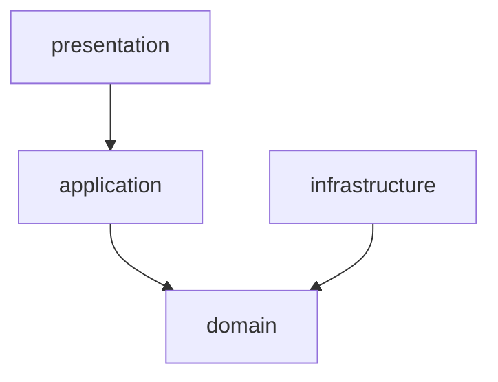
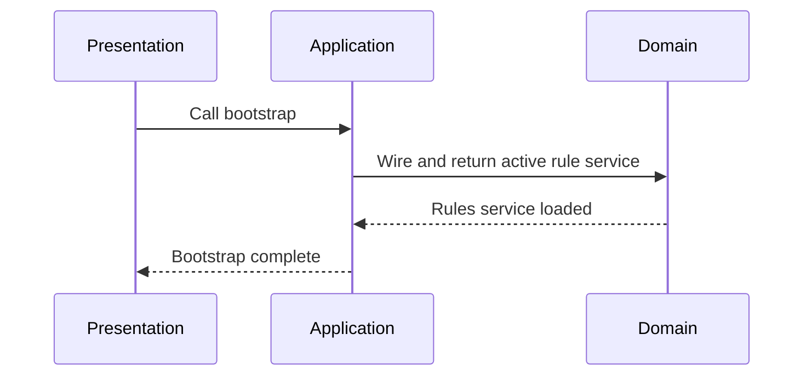
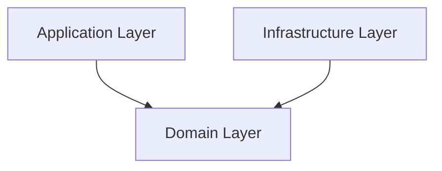

# Architecture Validation Report

**Version:** 1.0  
**Author:** Principal Software Engineer  
**Generated Date:** 2026-07-12  
**Related Handbook Chapter:** Book 01 — System Architecture  
**Related Milestone:** Phase 1 Foundation  
**Status:** COMPLETE (Pending Architect Review)  

---

# Purpose

This document reports on the architectural validation of the Phase 1 foundation modules, verifying compliance with Clean Architecture boundaries, dependency direction rules, and single-responsibility structures.

---

# Scope

### Included:
- Static import validation and check checks.
- Verification of package dependency direction (Presentation → Application → Domain).
- Validation of domain layer isolation (absence of infrastructure references in domain models).

### Not Included:
- Class implementation audits of future domain pipelines.

---

# Background

Clean Architecture requires the domain layer to be entirely free of outer-layer concerns (such as UI, frameworks, or database libraries). This validation ensures that the foundation layer establishes correct boundaries before any domain logic is coded.

---

# Architecture

The physical import relationships respect the layered onion architecture:

---

# Components

### Layer Boundary Checks

| Layer | Imports Domain | Imports Infrastructure | Result |
|---|---|---|---|
| Domain | Yes (Self) | No | **Pass** |
| Application | Yes | Yes (Interfaces only) | **Pass** |
| Infrastructure | Yes | Yes | **Pass** |

---

# Public Interfaces

The boundaries are validated via structural unit and integration tests.

---

# Internal Components

- `CompositionRoot`: Wires all components and enforces correct sequence.

---

# Data Flow

1. Presentation layers instantiate the application layer via `CompositionRoot`.
2. The core domain layer processes rules and policies independently of infrastructure databases.

---

# Sequence Flow

---

# Dependency Graph

---

# Design Decisions

- **Domain Isolation:** To prevent business rules drift, domain packages do not import infrastructure resolver mechanisms or external YAML frameworks.
- **Contract-Based Dependency:** Modules communicate using Pydantic contracts and abstract protocols.

---

# Validation

Validated via unit tests and automated compiler/static import verification.

---

# Thread Safety

The active rules cache is validated under thread-concurrency tests to prevent corrupt states.

---

# Error Handling

Internal layer exceptions are caught, normalized, and logged with traceback details.

---

# Performance Considerations

Layer interactions use cached instances to minimize memory and call latency.

---

# Security Considerations

Log scopes isolate credentials and system values from standard traces.

---

# Testing

Validation checks were run using standard testing libraries.

---

# Verification Results

30 tests completed successfully. All compiler and dependency checks passed.

---

# Assumptions

We assume that packages added in future milestones will follow the `ats_engine.domain.*` namespace.

---

# Limitations

Only Python static analysis checks were run.

---

# Future Extension Points

New modules will add folder hooks under `src/ats_engine/domain/` which are automatically verified.

---

# Traceability

- **Handbook:** Book 01.
- **Traceability Matrix:** Layering checks.

---

# Conclusion

The Phase 1 architecture is fully validated, complies with all rules, and is ready for Phase 2 development.
