# Canonical Document Class Diagram

**Version:** 1.0  
**Author:** Principal Software Engineer  
**Generated Date:** 2026-07-12  
**Related Handbook Chapter:** Book 02 — Document Processing  
**Related Milestone:** Milestone 2.4 — Canonical Document Validation  
**Status:** COMPLETE  

---

# Purpose

This document contains the class diagram for the canonical validation layer.

---

# Architecture

```mermaid
classDiagram
    class DocumentValidationService {
        -_rules: CanonicalValidationRules
        -_logger: Logger
        +validate_and_assemble(raw_document, normalized_document, document_layout, segment_collection, parser_used) CanonicalDocument
    }

    class DocumentIntegrityValidator {
        +validate(layout, segments, rules) None
    }

    class DocumentConsistencyValidator {
        +validate(normalized, layout, segments, rules) None
        -_block_key(block) str
    }

    class DocumentStatisticsBuilder {
        +build(normalized, layout, segments) CanonicalStatistics
    }

    class CanonicalDocumentBuilder {
        +build_metadata(raw_document, page_count, parser_used) CanonicalMetadata
    }

    class CanonicalDocumentAssembler {
        +assemble(normalized_document, document_layout, segment_collection, metadata, statistics) CanonicalDocument
    }

    class CanonicalValidationRules {
        +min_allowed_characters: int
        +max_allowed_pages: int
        +allowable_character_count_variance: float
        +enable_variance_tolerance: bool
    }

    class CanonicalMetadata {
        +canonical_id: str
        +source_filename: str
        +file_size_bytes: int
        +page_count: int
        +parser_used: str
        +encoding: str
    }

    class CanonicalStatistics {
        +total_characters: int
        +total_lines: int
        +total_paragraphs: int
        +total_segments: int
        +total_blocks: int
    }

    class CanonicalDocument {
        +canonical_id: str
        +normalized_document: NormalizedDocument
        +document_layout: DocumentLayout
        +segment_collection: SegmentCollection
        +metadata: CanonicalMetadata
        +statistics: CanonicalStatistics
    }

    DocumentValidationService --> DocumentIntegrityValidator : uses
    DocumentValidationService --> DocumentConsistencyValidator : uses
    DocumentValidationService --> DocumentStatisticsBuilder : uses
    DocumentValidationService --> CanonicalDocumentBuilder : uses
    DocumentValidationService --> CanonicalDocumentAssembler : uses
    DocumentValidationService --> CanonicalValidationRules : consumes
    CanonicalDocumentBuilder ..> CanonicalMetadata : compiles
    DocumentStatisticsBuilder ..> CanonicalStatistics : compiles
    CanonicalDocumentAssembler ..> CanonicalDocument : compiles
```

