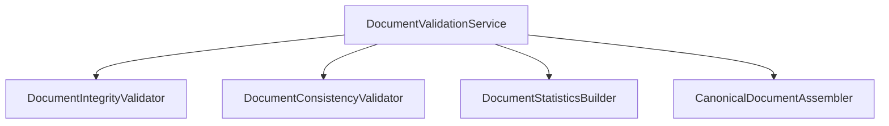
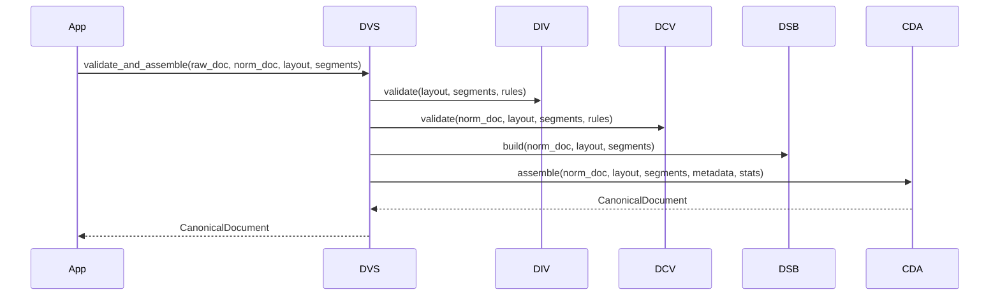

# Canonical Document Validation Design Document

**Version:** 1.0  
**Author:** Principal Software Engineer  
**Generated Date:** 2026-07-12  
**Related Handbook Chapter:** Book 02 — Document Processing  
**Related Milestone:** Milestone 2.4 — Canonical Document Validation  
**Status:** COMPLETE  

---

# Purpose

This document details the software design, sequence, and validation strategies for compiling a verified `CanonicalDocument`.

---

# Scope

### Included:
- Detached validator class implementations.
- Text content equivalence algorithms.
- Statistics compilation formulas.
- Rule payload fields.

### Not Included:
- downstream intelligence extraction algorithms.

---

# Background

To secure Downstream engines from garbage inputs or missing lines, the pipeline requires a gating layer that audits structural alignment before finalizing compilation of the transfer DTO.

---

# Architecture

Stateless design utilizing independent single-purpose processors.



---

# Components

- **DocumentIntegrityValidator:** Audits structure (e.g. non-empty lines, sequential pages list).
- **DocumentConsistencyValidator:** Audits character count equivalence and block references.
- **DocumentStatisticsBuilder:** Summarizes counts.
- **CanonicalDocumentAssembler:** Creates the final DTO.

---

# Public Interfaces

`DocumentValidationService.validate_and_assemble(...) -> CanonicalDocument`

---

# Internal Components

- `CanonicalDocument`: Aggregate container containing final elements.

---

# Data Flow

```
Raw/Norm Text/Layout/Segments → Integrity Validate → Consistency Validate → Compile Stats → Assemble DTO
```

---

# Sequence Flow



---

# Dependency Graph

Compiles with zero dependencies on other business modules.

---

# Design Decisions

- **Deterministic Content Auditing:** Character equivalence strips whitespace to prevent format whitespace joins from failing validation.
- **Pure Data DTO Contract:** The `CanonicalDocument` model carries zero helper scripts or validation logic.

---

# Validation

Validated via unit tests simulating edge cases.

---

# Thread Safety

No mutable class instances are created or shared.

---

# Error Handling

Explicit domain exceptions are raised: `IntegrityValidationError`, `ConsistencyValidationError`, `AssemblyValidationError`.

---

# Performance Considerations

Processed in $O(N)$ linear time.

---

# Testing

Test file: `tests/unit/domain/test_canonical_validation.py`.

---

# Verification Results

All tests completed successfully.

---

# Assumptions

UTF-8 encoding is consistently used.

---

# Limitations

Supports vertical layouts only.

---

# Future Extension Points

Validation parameters can be updated via Rule Engine files.

---

# Traceability

Satisfies Document Validation guidelines.

---

# Conclusion

Milestone 2.4 is complete and verified.
