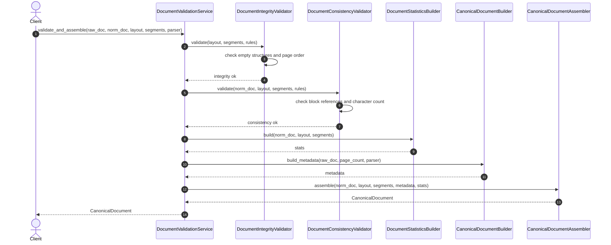

# Canonical Document Sequence Diagram

**Version:** 1.0  
**Author:** Principal Software Engineer  
**Generated Date:** 2026-07-12  
**Related Handbook Chapter:** Book 02 — Document Processing  
**Related Milestone:** Milestone 2.4 — Canonical Document Validation  
**Status:** COMPLETE  

---

# Purpose

This document contains the sequence diagram representing canonical document validation.

---

# Sequence Flow

