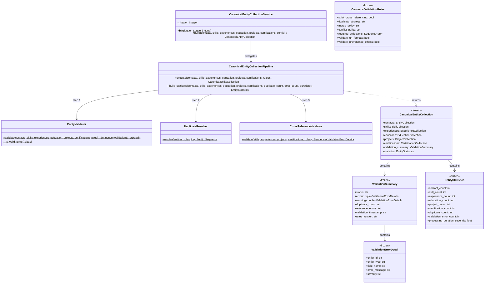

# Canonical Entity Collection Class Diagram

## Book 03 — Entity Extraction | Milestone 3.9

```mermaid
classDiagram
    class CanonicalEntityCollectionService {
        -_logger: Logger
        +__init__(logger: Logger | None)
        +build(contacts, skills, experiences, education, projects, certifications, config) CanonicalEntityCollection
    }

    class CanonicalEntityCollectionPipeline {
        +execute(contacts, skills, experiences, education, projects, certifications, rules)$ CanonicalEntityCollection
        -_build_statistics(contacts, skills, experiences, education, projects, certifications, duplicate_count, error_count, duration)$ EntityStatistics
    }

    class EntityValidator {
        +validate(contacts, skills, experiences, education, projects, certifications, rules)$ Sequence~ValidationErrorDetail~
        -_is_valid_url(url)$ bool
    }

    class DuplicateResolver {
        +resolve(entities, rules, key_field)$ Sequence
    }

    class CrossReferenceValidator {
        +validate(skills, experiences, projects, certifications, rules)$ Sequence~ValidationErrorDetail~
    }

    class CanonicalValidationRules {
        <<frozen>>
        +strict_cross_referencing: bool
        +duplicate_strategy: str
        +merge_policy: str
        +conflict_policy: str
        +required_collections: Sequence~str~
        +validate_url_formats: bool
        +validate_provenance_offsets: bool
    }

    class CanonicalEntityCollection {
        <<frozen>>
        +contacts: EntityCollection
        +skills: SkillCollection
        +experiences: ExperienceCollection
        +education: EducationCollection
        +projects: ProjectCollection
        +certifications: CertificationCollection
        +validation_summary: ValidationSummary
        +statistics: EntityStatistics
    }

    class ValidationSummary {
        <<frozen>>
        +status: str
        +errors: tuple~ValidationErrorDetail~
        +warnings: tuple~ValidationErrorDetail~
        +duplicate_count: int
        +reference_errors: int
        +validation_timestamp: str
        +rules_version: str
    }

    class ValidationErrorDetail {
        <<frozen>>
        +entity_id: str
        +entity_type: str
        +field_name: str
        +error_message: str
        +severity: str
    }

    class EntityStatistics {
        <<frozen>>
        +contact_count: int
        +skill_count: int
        +experience_count: int
        +education_count: int
        +project_count: int
        +certification_count: int
        +duplicate_count: int
        +validation_error_count: int
        +processing_duration_seconds: float
    }

    CanonicalEntityCollectionService --> CanonicalEntityCollectionPipeline : delegates
    CanonicalEntityCollectionPipeline --> EntityValidator : step 1
    CanonicalEntityCollectionPipeline --> DuplicateResolver : step 2
    CanonicalEntityCollectionPipeline --> CrossReferenceValidator : step 3
    CanonicalEntityCollectionPipeline ..> CanonicalEntityCollection : returns
    CanonicalEntityCollection --> ValidationSummary : contains
    CanonicalEntityCollection --> EntityStatistics : contains
    ValidationSummary --> ValidationErrorDetail : contains
```
