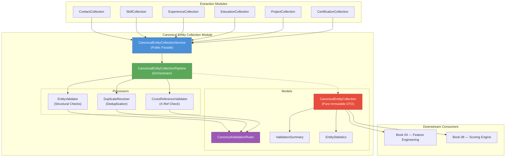

# Canonical Entity Collection Component Diagram

## Book 03 — Entity Extraction | Milestone 3.9

```mermaid
graph TB
    subgraph "Downstream Consumers"
        FEATURE["Book 04 — Feature Engineering"]
        SCORE["Book 08 — Scoring Engine"]
    end

    subgraph "Canonical Entity Collection Module"
        SERVICE["CanonicalEntityCollectionService<br/>(Public Facade)"]
        PIPELINE["CanonicalEntityCollectionPipeline<br/>(Orchestrator)"]

        subgraph "Processors"
            EV["EntityValidator<br/>(Structural Checks)"]
            DR["DuplicateResolver<br/>(Deduplication)"]
            XV["CrossReferenceValidator<br/>(X-Ref Check)"]
        end

        subgraph "Models"
            RULES["CanonicalValidationRules"]
            DTO["CanonicalEntityCollection<br/>(Pure Immutable DTO)"]
            VS["ValidationSummary"]
            ES["EntityStatistics"]
        end
    end

    subgraph "Extraction Modules"
        CONTACT["ContactCollection"]
        SKILL["SkillCollection"]
        EXP["ExperienceCollection"]
        EDU["EducationCollection"]
        PROJ["ProjectCollection"]
        CERT["CertificationCollection"]
    end

    CONTACT --> SERVICE
    SKILL --> SERVICE
    EXP --> SERVICE
    EDU --> SERVICE
    PROJ --> SERVICE
    CERT --> SERVICE

    SERVICE --> PIPELINE
    PIPELINE --> EV
    PIPELINE --> DR
    PIPELINE --> XV

    EV --> RULES
    DR --> RULES
    XV --> RULES

    PIPELINE -.-> DTO
    DTO --> VS
    DTO --> ES

    DTO --> FEATURE
    DTO --> SCORE

    style SERVICE fill:#4a90d9,stroke:#2c5f8a,color:#fff
    style PIPELINE fill:#5ba85b,stroke:#3d7a3d,color:#fff
    style DTO fill:#e74c3c,stroke:#c0392b,color:#fff
    style RULES fill:#9b59b6,stroke:#7d3c98,color:#fff
```
