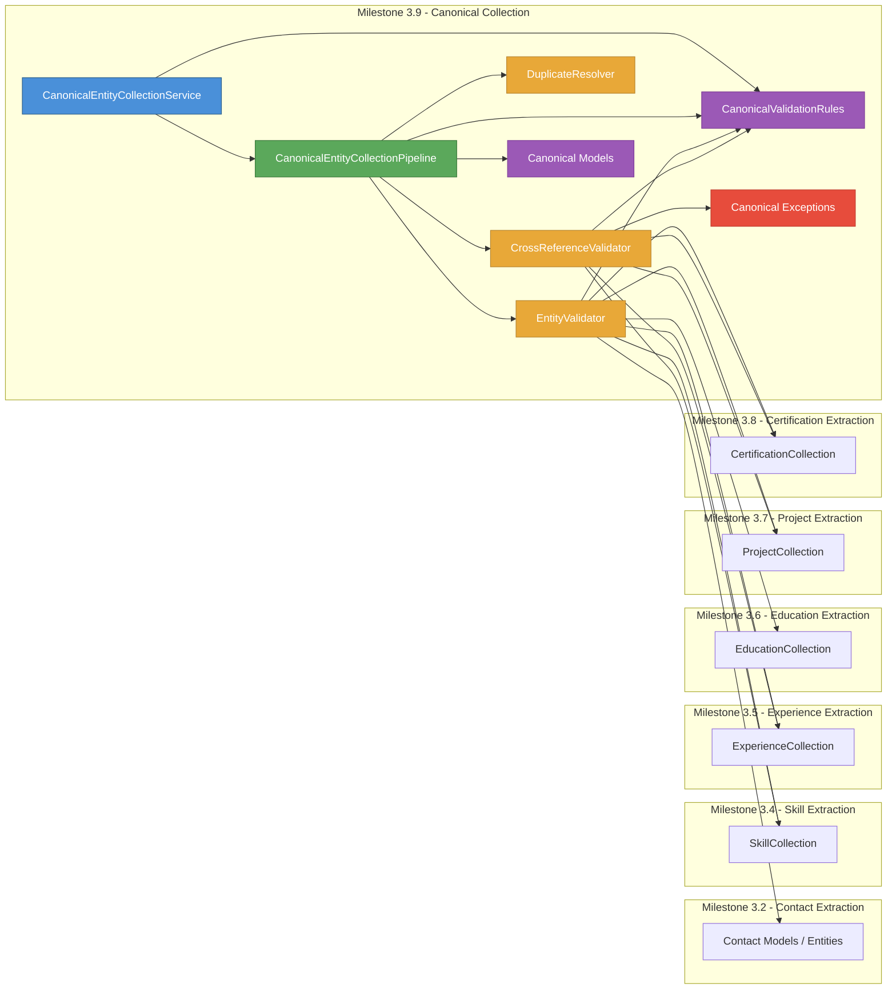

# Canonical Entity Collection Dependency Graph

## Book 03 — Entity Extraction | Milestone 3.9

```mermaid
graph LR
    subgraph "Milestone 3.9 - Canonical Collection"
        SVC["CanonicalEntityCollectionService"]
        PL["CanonicalEntityCollectionPipeline"]
        EV["EntityValidator"]
        DR["DuplicateResolver"]
        XV["CrossReferenceValidator"]
        MD["Canonical Models"]
        RL["CanonicalValidationRules"]
        EX["Canonical Exceptions"]
    end

    subgraph "Milestone 3.2 - Contact Extraction"
        CNT["Contact Models / Entities"]
    end

    subgraph "Milestone 3.4 - Skill Extraction"
        SK["SkillCollection"]
    end

    subgraph "Milestone 3.5 - Experience Extraction"
        EXP["ExperienceCollection"]
    end

    subgraph "Milestone 3.6 - Education Extraction"
        EDU["EducationCollection"]
    end

    subgraph "Milestone 3.7 - Project Extraction"
        PRJ["ProjectCollection"]
    end

    subgraph "Milestone 3.8 - Certification Extraction"
        CRT["CertificationCollection"]
    end

    SVC --> PL
    SVC --> RL
    PL --> EV
    PL --> DR
    PL --> XV
    PL --> MD
    PL --> RL
    EV --> CNT
    EV --> SK
    EV --> EXP
    EV --> EDU
    EV --> PRJ
    EV --> CRT
    EV --> RL
    XV --> SK
    XV --> EXP
    XV --> PRJ
    XV --> CRT
    XV --> RL
    XV --> EX

    style SVC fill:#4a90d9,stroke:#2c5f8a,color:#fff
    style PL fill:#5ba85b,stroke:#3d7a3d,color:#fff
    style EV fill:#e8a838,stroke:#b8842c,color:#fff
    style DR fill:#e8a838,stroke:#b8842c,color:#fff
    style XV fill:#e8a838,stroke:#b8842c,color:#fff
    style MD fill:#9b59b6,stroke:#7d3c98,color:#fff
    style RL fill:#9b59b6,stroke:#7d3c98,color:#fff
    style EX fill:#e74c3c,stroke:#c0392b,color:#fff
```
