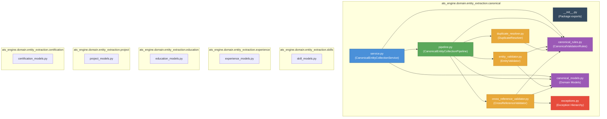

# Canonical Entity Collection Package Diagram

## Book 03 — Entity Extraction | Milestone 3.9

```mermaid
graph TB
    subgraph "ats_engine.domain.entity_extraction.canonical"
        INIT["__init__.py<br/>(Package exports)"]
        SVC["service.py<br/>(CanonicalEntityCollectionService)"]
        PL["pipeline.py<br/>(CanonicalEntityCollectionPipeline)"]
        EV["entity_validator.py<br/>(EntityValidator)"]
        DR["duplicate_resolver.py<br/>(DuplicateResolver)"]
        XV["cross_reference_validator.py<br/>(CrossReferenceValidator)"]
        MD["canonical_models.py<br/>(Domain Models)"]
        RL["canonical_rules.py<br/>(CanonicalValidationRules)"]
        EX["exceptions.py<br/>(Exception Hierarchy)"]
    end

    subgraph "ats_engine.domain.entity_extraction.skills"
        SK["skill_models.py"]
    end

    subgraph "ats_engine.domain.entity_extraction.experience"
        EXM["experience_models.py"]
    end

    subgraph "ats_engine.domain.entity_extraction.education"
        EDM["education_models.py"]
    end

    subgraph "ats_engine.domain.entity_extraction.project"
        PRM["project_models.py"]
    end

    subgraph "ats_engine.domain.entity_extraction.certification"
        CEM["certification_models.py"]
    end

    SVC --> PL
    SVC --> RL
    SVC --> MD
    PL --> EV
    PL --> DR
    PL --> XV
    PL --> MD
    PL --> RL
    EV --> MD
    EV --> RL
    DR --> RL
    XV --> MD
    XV --> RL
    XV --> EX

    style INIT fill:#34495e,stroke:#2c3e50,color:#fff
    style SVC fill:#4a90d9,stroke:#2c5f8a,color:#fff
    style PL fill:#5ba85b,stroke:#3d7a3d,color:#fff
    style EV fill:#e8a838,stroke:#b8842c,color:#fff
    style DR fill:#e8a838,stroke:#b8842c,color:#fff
    style XV fill:#e8a838,stroke:#b8842c,color:#fff
    style MD fill:#9b59b6,stroke:#7d3c98,color:#fff
    style RL fill:#9b59b6,stroke:#7d3c98,color:#fff
    style EX fill:#e74c3c,stroke:#c0392b,color:#fff
```
