# Canonical Feature Collection Class Diagram

## Book 04 — Feature Engineering | Milestone 4.6

The class diagram outlines the interfaces and helper classes supporting `CanonicalFeatureCollectionService`:

```mermaid
classDiagram
    class CanonicalFeatureCollectionService {
        -_logger: Logger
        -_pipeline: CanonicalFeatureCollectionPipeline
        +build(skills, experience, education, projects, certifications, rules) CanonicalFeatureCollection
    }

    class CanonicalFeatureCollectionPipeline {
        -_logger: Logger
        -_validator: FeatureValidator
        -_resolver: DuplicateFeatureResolver
        -_cross_validator: CrossFeatureValidator
        +execute(skills, experience, education, projects, certifications, rules) CanonicalFeatureCollection
    }

    class FeatureValidator {
        -_logger: Logger
        +validate(features, rules) tuple~list, list~
    }

    class DuplicateFeatureResolver {
        +resolve(features, policy) tuple~Sequence, int~
    }

    class CrossFeatureValidator {
        -_logger: Logger
        +validate(features, rules) tuple~list, list~
    }

    class FeatureStatisticsBuilder {
        +build(features, duplicate_count, error_count, warning_count) FeatureStatistics
    }

    class ValidationSummaryBuilder {
        +build(errors, warnings, duplicate_count, rules_version) ValidationSummary
    }

    class CanonicalFeatureCollectionBuilder {
        +build(skills, experience, education, projects, certifications, statistics, validation_summary, metadata) CanonicalFeatureCollection
    }

    CanonicalFeatureCollectionService --> CanonicalFeatureCollectionPipeline
    CanonicalFeatureCollectionPipeline --> FeatureValidator
    CanonicalFeatureCollectionPipeline --> DuplicateFeatureResolver
    CanonicalFeatureCollectionPipeline --> CrossFeatureValidator
    CanonicalFeatureCollectionPipeline --> FeatureStatisticsBuilder
    CanonicalFeatureCollectionPipeline --> ValidationSummaryBuilder
    CanonicalFeatureCollectionPipeline --> CanonicalFeatureCollectionBuilder
```

