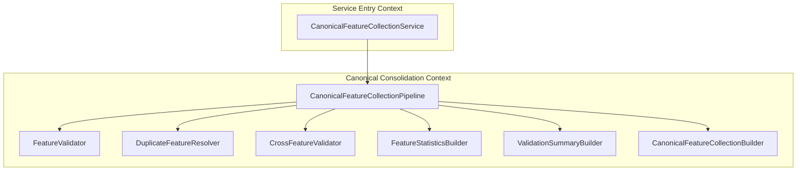

# Canonical Feature Collection Component Diagram

## Book 04 — Feature Engineering | Milestone 4.6

The diagram maps relationships of components within the validation and consolidation layer:

```mermaid
graph TD
    subgraph "Service Entry Context"
        Service["CanonicalFeatureCollectionService"]
    end

    subgraph "Canonical Consolidation Context"
        Pipeline["CanonicalFeatureCollectionPipeline"]
        Validator["FeatureValidator"]
        Resolver["DuplicateFeatureResolver"]
        Cross["CrossFeatureValidator"]
        Stats["FeatureStatisticsBuilder"]
        Summary["ValidationSummaryBuilder"]
        Builder["CanonicalFeatureCollectionBuilder"]
    end

    Service --> Pipeline
    Pipeline --> Validator
    Pipeline --> Resolver
    Pipeline --> Cross
    Pipeline --> Stats
    Pipeline --> Summary
    Pipeline --> Builder
```
