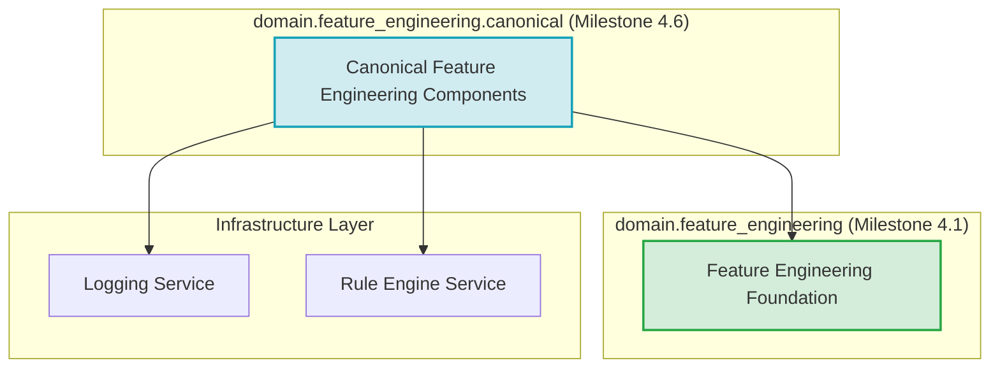

# Canonical Feature Collection Dependency Graph

## Book 04 — Feature Engineering | Milestone 4.6

The dependency graph illustrates clean import structures and boundaries:

```mermaid
graph TD
    subgraph "domain.feature_engineering.canonical (Milestone 4.6)"
        CanonicalFeature["Canonical Feature Engineering Components"]
    end

    subgraph "domain.feature_engineering (Milestone 4.1)"
        BaseFoundation["Feature Engineering Foundation"]
    end

    subgraph "Infrastructure Layer"
        Logging["Logging Service"]
        RuleEngine["Rule Engine Service"]
    end

    CanonicalFeature --> BaseFoundation
    CanonicalFeature --> Logging
    CanonicalFeature --> RuleEngine

    %% Style representations
    style CanonicalFeature fill:#d1ecf1,stroke:#17a2b8,stroke-width:2px
    style BaseFoundation fill:#d4edda,stroke:#28a745,stroke-width:2px
```
