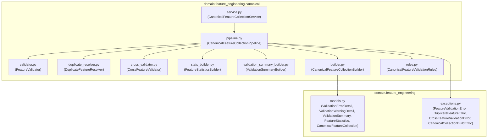

# Canonical Feature Collection Package Diagram

## Book 04 — Feature Engineering | Milestone 4.6

The package boundary view details the files organized inside the `canonical` feature engineering sub-directory:

