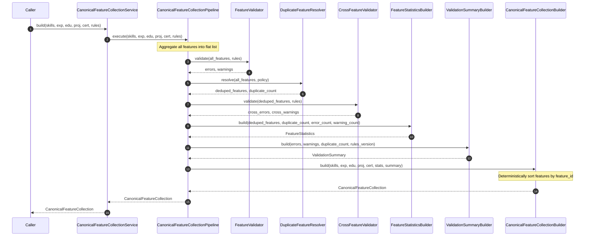

# Canonical Feature Collection Sequence Diagram

## Book 04 — Feature Engineering | Milestone 4.6

The sequence timeline outlines execution calls during the consolidation workflow:

```mermaid
sequenceDiagram
    autonumber
    participant Caller
    participant Service as CanonicalFeatureCollectionService
    participant Pipeline as CanonicalFeatureCollectionPipeline
    participant Validator as FeatureValidator
    participant Resolver as DuplicateFeatureResolver
    participant Cross as CrossFeatureValidator
    participant Stats as FeatureStatisticsBuilder
    participant Summary as ValidationSummaryBuilder
    participant Builder as CanonicalFeatureCollectionBuilder

    Caller ->> Service: build(skills, exp, edu, proj, cert, rules)
    Service ->> Pipeline: execute(skills, exp, edu, proj, cert, rules)
    Note over Pipeline: Aggregate all features into flat list
    Pipeline ->> Validator: validate(all_features, rules)
    Validator -->> Pipeline: errors, warnings
    Pipeline ->> Resolver: resolve(all_features, policy)
    Resolver -->> Pipeline: deduped_features, duplicate_count
    Pipeline ->> Cross: validate(deduped_features, rules)
    Cross -->> Pipeline: cross_errors, cross_warnings
    Pipeline ->> Stats: build(deduped_features, duplicate_count, error_count, warning_count)
    Stats -->> Pipeline: FeatureStatistics
    Pipeline ->> Summary: build(errors, warnings, duplicate_count, rules_version)
    Summary -->> Pipeline: ValidationSummary
    Pipeline ->> Builder: build(skills, exp, edu, proj, cert, stats, summary)
    Note over Builder: Deterministically sort features by feature_id
    Builder -->> Pipeline: CanonicalFeatureCollection
    Pipeline -->> Service: CanonicalFeatureCollection
    Service -->> Caller: CanonicalFeatureCollection
```
