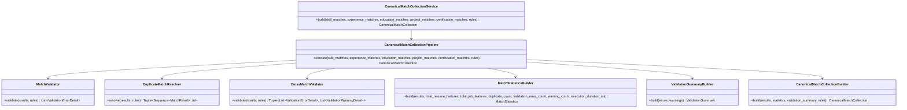

# Canonical Match Collection Class Diagram

```mermaid
classDiagram
    direction TB
    class CanonicalMatchCollectionService {
        +build(skill_matches, experience_matches, education_matches, project_matches, certification_matches, rules) CanonicalMatchCollection
    }
    class CanonicalMatchCollectionPipeline {
        +execute(skill_matches, experience_matches, education_matches, project_matches, certification_matches, rules) CanonicalMatchCollection
    }
    class MatchValidator {
        +validate(results, rules) List~ValidationErrorDetail~
    }
    class DuplicateMatchResolver {
        +resolve(results, rules) Tuple~Sequence~MatchResult~, int~
    }
    class CrossMatchValidator {
        +validate(results, rules) Tuple~List~ValidationErrorDetail~, List~ValidationWarningDetail~~
    }
    class MatchStatisticsBuilder {
        +build(results, total_resume_features, total_job_features, duplicate_count, validation_error_count, warning_count, execution_duration_ms) MatchStatistics
    }
    class ValidationSummaryBuilder {
        +build(errors, warnings) ValidationSummary
    }
    class CanonicalMatchCollectionBuilder {
        +build(results, statistics, validation_summary, rules) CanonicalMatchCollection
    }

    CanonicalMatchCollectionService --> CanonicalMatchCollectionPipeline
    CanonicalMatchCollectionPipeline --> MatchValidator
    CanonicalMatchCollectionPipeline --> DuplicateMatchResolver
    CanonicalMatchCollectionPipeline --> CrossMatchValidator
    CanonicalMatchCollectionPipeline --> MatchStatisticsBuilder
    CanonicalMatchCollectionPipeline --> ValidationSummaryBuilder
    CanonicalMatchCollectionPipeline --> CanonicalMatchCollectionBuilder
```
