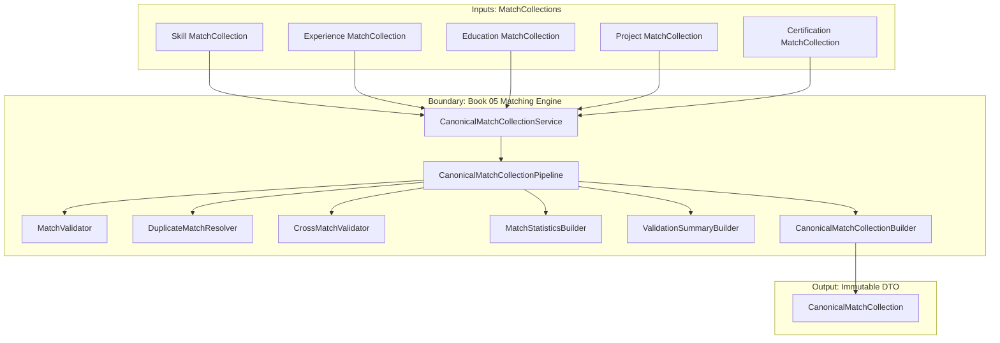

# Canonical Match Collection Component Diagram

```mermaid
graph TD
    subgraph Boundary: Book 05 Matching Engine
        Service[CanonicalMatchCollectionService]
        Pipeline[CanonicalMatchCollectionPipeline]
        Validator[MatchValidator]
        Resolver[DuplicateMatchResolver]
        CrossValidator[CrossMatchValidator]
        StatsBuilder[MatchStatisticsBuilder]
        SummaryBuilder[ValidationSummaryBuilder]
        Builder[CanonicalMatchCollectionBuilder]
    end

    subgraph Inputs: MatchCollections
        Skill[Skill MatchCollection]
        Exp[Experience MatchCollection]
        Edu[Education MatchCollection]
        Proj[Project MatchCollection]
        Cert[Certification MatchCollection]
    end

    subgraph Output: Immutable DTO
        DTO[CanonicalMatchCollection]
    end

    Skill & Exp & Edu & Proj & Cert --> Service
    Service --> Pipeline
    Pipeline --> Validator
    Pipeline --> Resolver
    Pipeline --> CrossValidator
    Pipeline --> StatsBuilder
    Pipeline --> SummaryBuilder
    Pipeline --> Builder
    Builder --> DTO
```
