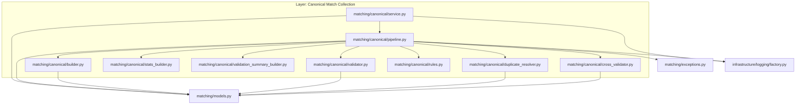

# Canonical Match Collection Dependency Graph

```mermaid
graph TD
    subgraph Layer: Canonical Match Collection
        matching/canonical/service.py --> matching/canonical/pipeline.py
        matching/canonical/pipeline.py --> matching/canonical/validator.py
        matching/canonical/pipeline.py --> matching/canonical/duplicate_resolver.py
        matching/canonical/pipeline.py --> matching/canonical/cross_validator.py
        matching/canonical/pipeline.py --> matching/canonical/stats_builder.py
        matching/canonical/pipeline.py --> matching/canonical/validation_summary_builder.py
        matching/canonical/pipeline.py --> matching/canonical/builder.py
        matching/canonical/pipeline.py --> matching/canonical/rules.py
    end

    matching/canonical/service.py & matching/canonical/pipeline.py & matching/canonical/builder.py & matching/canonical/validator.py & matching/canonical/duplicate_resolver.py & matching/canonical/cross_validator.py --> matching/models.py
    matching/canonical/pipeline.py --> matching/exceptions.py
    matching/canonical/service.py & matching/canonical/pipeline.py --> infrastructure/logging/factory.py
```
