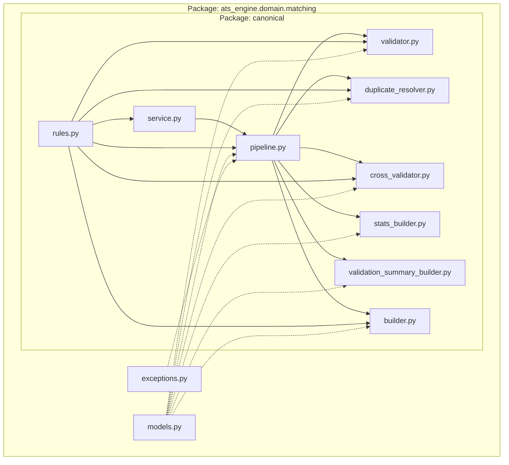

# Canonical Match Collection Package Diagram

```mermaid
graph TD
    subgraph Package: ats_engine.domain.matching
        models.py[models.py]
        exceptions.py[exceptions.py]
        
        subgraph Package: canonical
            rules.py[rules.py]
            validator.py[validator.py]
            duplicate_resolver.py[duplicate_resolver.py]
            cross_validator.py[cross_validator.py]
            stats_builder.py[stats_builder.py]
            validation_summary_builder.py[validation_summary_builder.py]
            builder.py[builder.py]
            pipeline.py[pipeline.py]
            service.py[service.py]
        end
    end

    service.py --> pipeline.py
    pipeline.py --> validator.py & duplicate_resolver.py & cross_validator.py & stats_builder.py & validation_summary_builder.py & builder.py
    rules.py --> service.py & pipeline.py & validator.py & duplicate_resolver.py & cross_validator.py & builder.py
    models.py -.-> pipeline.py & validator.py & duplicate_resolver.py & cross_validator.py & stats_builder.py & validation_summary_builder.py & builder.py
    exceptions.py -.-> pipeline.py
```
