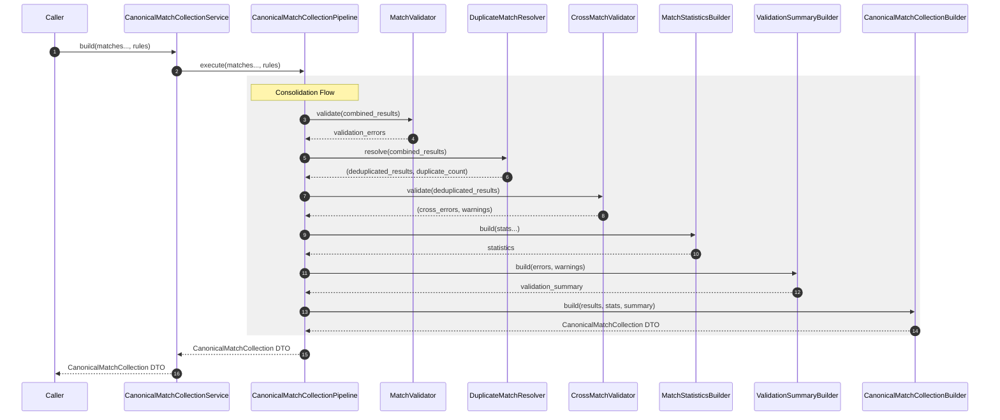

# Canonical Match Collection Sequence Diagram

```mermaid
sequenceDiagram
    autonumber
    Caller ->> CanonicalMatchCollectionService: build(matches..., rules)
    CanonicalMatchCollectionService ->> CanonicalMatchCollectionPipeline: execute(matches..., rules)
    
    rect rgb(240, 240, 240)
        note over CanonicalMatchCollectionPipeline: Consolidation Flow
        CanonicalMatchCollectionPipeline ->> MatchValidator: validate(combined_results)
        MatchValidator -->> CanonicalMatchCollectionPipeline: validation_errors
        
        CanonicalMatchCollectionPipeline ->> DuplicateMatchResolver: resolve(combined_results)
        DuplicateMatchResolver -->> CanonicalMatchCollectionPipeline: (deduplicated_results, duplicate_count)
        
        CanonicalMatchCollectionPipeline ->> CrossMatchValidator: validate(deduplicated_results)
        CrossMatchValidator -->> CanonicalMatchCollectionPipeline: (cross_errors, warnings)
        
        CanonicalMatchCollectionPipeline ->> MatchStatisticsBuilder: build(stats...)
        MatchStatisticsBuilder -->> CanonicalMatchCollectionPipeline: statistics
        
        CanonicalMatchCollectionPipeline ->> ValidationSummaryBuilder: build(errors, warnings)
        ValidationSummaryBuilder -->> CanonicalMatchCollectionPipeline: validation_summary
        
        CanonicalMatchCollectionPipeline ->> CanonicalMatchCollectionBuilder: build(results, stats, summary)
        CanonicalMatchCollectionBuilder -->> CanonicalMatchCollectionPipeline: CanonicalMatchCollection DTO
    end
    
    CanonicalMatchCollectionPipeline -->> CanonicalMatchCollectionService: CanonicalMatchCollection DTO
    CanonicalMatchCollectionService -->> Caller: CanonicalMatchCollection DTO
```
