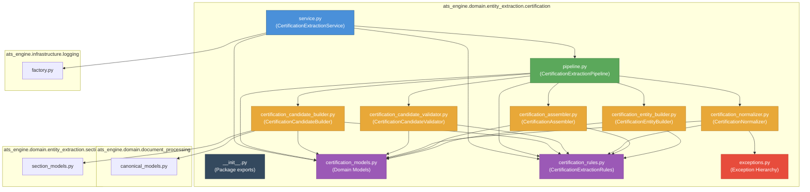

# Certification Extraction Package Diagram

## Book 03 — Entity Extraction | Milestone 3.8

```mermaid
graph TB
    subgraph "ats_engine.domain.entity_extraction.certification"
        INIT["__init__.py<br/>(Package exports)"]
        SVC["service.py<br/>(CertificationExtractionService)"]
        PL["pipeline.py<br/>(CertificationExtractionPipeline)"]
        CB["certification_candidate_builder.py<br/>(CertificationCandidateBuilder)"]
        CV["certification_candidate_validator.py<br/>(CertificationCandidateValidator)"]
        NR["certification_normalizer.py<br/>(CertificationNormalizer)"]
        AS["certification_assembler.py<br/>(CertificationAssembler)"]
        EB["certification_entity_builder.py<br/>(CertificationEntityBuilder)"]
        MD["certification_models.py<br/>(Domain Models)"]
        RL["certification_rules.py<br/>(CertificationExtractionRules)"]
        EX["exceptions.py<br/>(Exception Hierarchy)"]
    end

    subgraph "ats_engine.domain.document_processing"
        CD["canonical_models.py"]
    end

    subgraph "ats_engine.domain.entity_extraction.section"
        SM["section_models.py"]
    end

    subgraph "ats_engine.infrastructure.logging"
        LF["factory.py"]
    end

    SVC --> PL
    SVC --> RL
    SVC --> MD
    SVC --> LF
    PL --> CB
    PL --> CV
    PL --> NR
    PL --> AS
    PL --> EB
    PL --> MD
    PL --> RL
    CB --> CD
    CB --> SM
    CB --> MD
    CB --> RL
    CV --> MD
    CV --> RL
    NR --> MD
    NR --> RL
    NR --> EX
    AS --> MD
    AS --> RL
    EB --> MD
    EB --> RL

    style INIT fill:#34495e,stroke:#2c3e50,color:#fff
    style SVC fill:#4a90d9,stroke:#2c5f8a,color:#fff
    style PL fill:#5ba85b,stroke:#3d7a3d,color:#fff
    style CB fill:#e8a838,stroke:#b8842c,color:#fff
    style CV fill:#e8a838,stroke:#b8842c,color:#fff
    style NR fill:#e8a838,stroke:#b8842c,color:#fff
    style AS fill:#e8a838,stroke:#b8842c,color:#fff
    style EB fill:#e8a838,stroke:#b8842c,color:#fff
    style MD fill:#9b59b6,stroke:#7d3c98,color:#fff
    style RL fill:#9b59b6,stroke:#7d3c98,color:#fff
    style EX fill:#e74c3c,stroke:#c0392b,color:#fff
```
