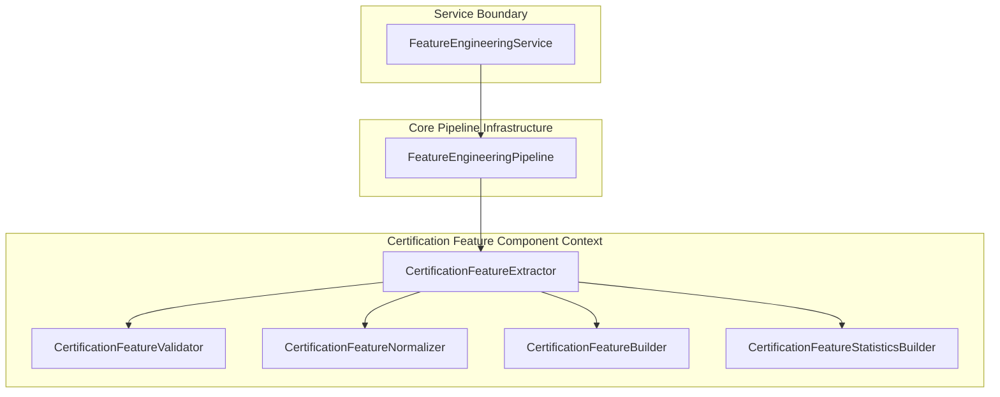

# Certification Feature Engineering Component Diagram

## Book 04 — Feature Engineering | Milestone 4.5

The diagram maps the relationships of components within the Feature Extraction Layer:

```mermaid
graph TD
    subgraph "Service Boundary"
        Service["FeatureEngineeringService"]
    end

    subgraph "Certification Feature Component Context"
        Extractor["CertificationFeatureExtractor"]
        Validator["CertificationFeatureValidator"]
        Normalizer["CertificationFeatureNormalizer"]
        Builder["CertificationFeatureBuilder"]
        Stats["CertificationFeatureStatisticsBuilder"]
    end

    subgraph "Core Pipeline Infrastructure"
        Pipeline["FeatureEngineeringPipeline"]
    end

    Service --> Pipeline
    Pipeline --> Extractor
    Extractor --> Validator
    Extractor --> Normalizer
    Extractor --> Builder
    Extractor --> Stats
```
