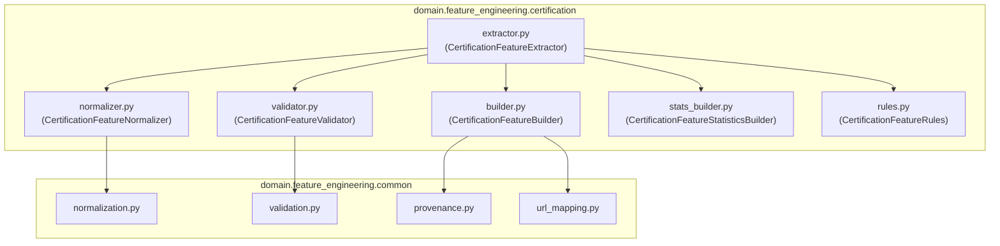

# Certification Feature Engineering Package Diagram

## Book 04 — Feature Engineering | Milestone 4.5

The package boundary view details the files organized inside the `certification` sub-directory:

