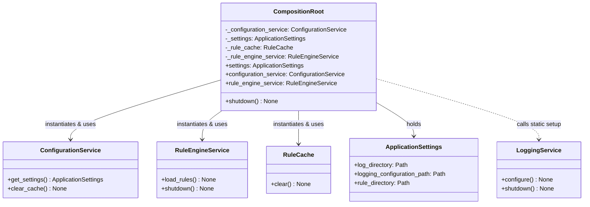

# Composition Root Class Diagram

```mermaid
classDiagram
    class CompositionRoot {
        -_configuration_service: ConfigurationService
        -_settings: ApplicationSettings
        -_rule_cache: RuleCache
        -_rule_engine_service: RuleEngineService
        +settings: ApplicationSettings
        +configuration_service: ConfigurationService
        +rule_engine_service: RuleEngineService
        +shutdown() None
    }

    class ConfigurationService {
        +get_settings() ApplicationSettings
        +clear_cache() None
    }

    class LoggingService {
        +configure() None
        +shutdown() None
    }

    class RuleEngineService {
        +load_rules() None
        +shutdown() None
    }

    class RuleCache {
        +clear() None
    }

    class ApplicationSettings {
        +log_directory: Path
        +logging_configuration_path: Path
        +rule_directory: Path
    }

    CompositionRoot --> ConfigurationService : instantiates & uses
    CompositionRoot --> RuleEngineService : instantiates & uses
    CompositionRoot --> RuleCache : instantiates & uses
    CompositionRoot --> ApplicationSettings : holds
    CompositionRoot ..> LoggingService : calls static setup
```
