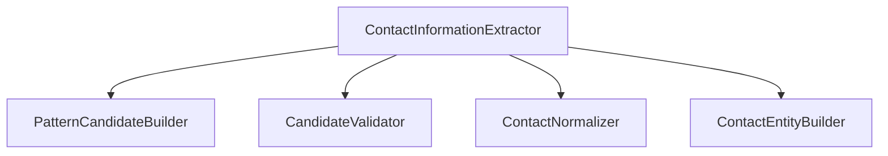
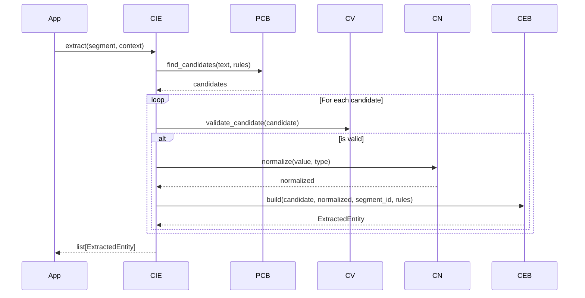

# Contact Information Extraction Design Document

**Version:** 1.0  
**Author:** Principal Software Engineer  
**Generated Date:** 2026-07-12  
**Related Handbook Chapter:** Book 03 — Entity Extraction  
**Related Milestone:** Milestone 3.2 — Contact Information Extraction  
**Status:** COMPLETE  

---

# Purpose

This document details the software design, pipelines, components, and validation rules for the Contact Information Extraction module.

---

# Scope

### Included:
- Regex candidate scanning and compiles.
- Email, phone, and url validation rules.
- Location and name extension points.
- Normalization rules.

### Not Included:
- Skills or Experience extraction.

---

# Background

Contact information (emails, phone numbers, and portfolio links) is critical for indexing. Parsing these details deterministically prevents system issues associated with parsing resumes.

---

# Architecture

Stateless design utilizing independent single-purpose processors.



---

# Components

- **PatternCandidateBuilder:** Uses regexes to extract candidate details.
- **CandidateValidator:** Filters false hits.
- **ContactNormalizer:** Lowercases URLs/emails and standardizes phone formats.
- **ContactEntityBuilder:** Creates the final DTO.

---

# Public Interfaces

`ContactInformationExtractor.extract(segment, context) -> Sequence[ExtractedEntity]`

---

# Internal Components

- `ContactCandidate`: intermediate token representation.

---

# Data Flow

```
DocumentSegment.text_content → Regex Scan → Format Validate → Clean Value → Compile Entity DTO
```

---

# Sequence Flow



---

# Dependency Graph

Compiles with zero dependencies on other business modules.

---

# Design Decisions

- **URL Overlap Prevention:** Ensures portfolio patterns do not double-match LinkedIn or GitHub links.
- **Detached Contextual Entities:** Name and Location are out of scope for regex checks to prevent semantic leaks.

---

# Validation

Validated via unit tests.

---

# Thread Safety

No mutable class instances are created or shared.

---

# Error Handling

Explicit domain exceptions are raised: `CandidateValidationError`, `NormalizationError`, `PatternConfigurationError`.

---

# Performance Considerations

Processed in $O(N)$ linear time.

---

# Testing

Test file: `tests/unit/domain/test_contact_extraction.py`.

---

# Verification Results

All tests completed successfully.

---

# Assumptions

Segment character offsets refer strictly to normalized text.

---

# Limitations

Only email, phone, and standard links are parsed.

---

# Future Extension Points

A dedicated `NameExtractor` and `LocationExtractor` can be registered later as extension points.

---

# Traceability

Satisfies Contact Information Extraction guidelines.

---

# Conclusion

Milestone 3.2 is complete and verified.
