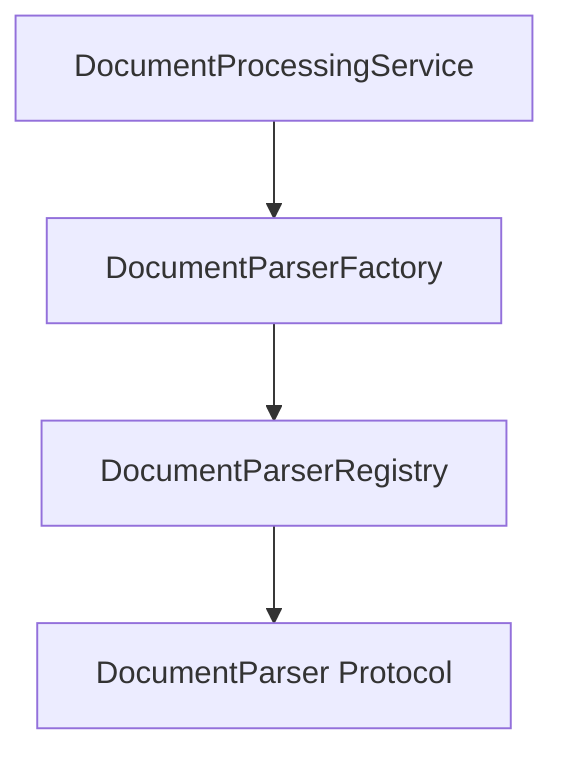
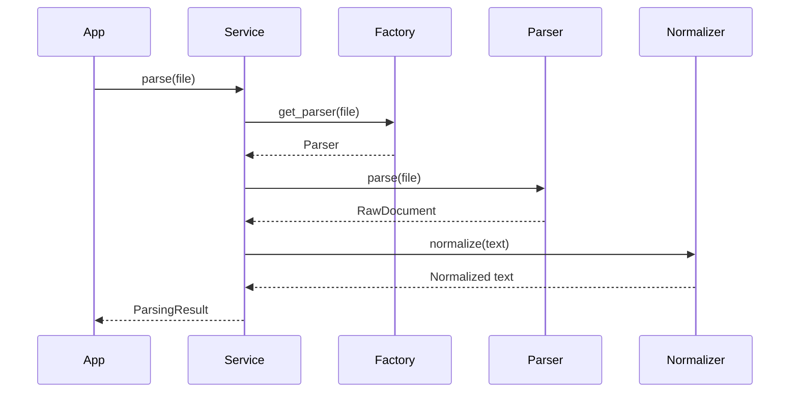

# Document Processing Architecture Document

**Version:** 1.0  
**Author:** Principal Software Engineer  
**Generated Date:** 2026-07-12  
**Related Handbook Chapter:** Book 02 — Document Processing  
**Related Milestone:** Milestone 2.1 — Document Processing Foundation  
**Status:** COMPLETE  

---

# Purpose

This document details the architectural layout, components, and pipelines of the Document Processing Foundation layer.

---

# Scope

### Included:
- Extractor interface (`DocumentParser`) and registry patterns.
- Concrete parsers for PDF and Word DOCX files.
- Signature checking factory.
- Text cleaning normalization pipelines.

---

# Background

This layer translates binary files from local storage or incoming streams into clean Unicode text and structure models, isolating downstream algorithms from third-party binary extraction packages.

---

# Architecture

Uses an onion-like dependency layout.



---

# Components

- **DocumentProcessingService:** Unified orchestration facade.
- **DocumentParserFactory:** File header signature analyser.
- **TextNormalizer:** Standalone Unicode and character pipeline.
- **PdfDocumentParser / DocxDocumentParser:** Format text extractors.

---

# Public Interfaces

Exposes the `DocumentProcessingService.parse(file_path)` API returning a `ParsingResult`.

---

# Internal Components

Stateless extraction parsers that interface with `PyMuPDF` and `python-docx`.

---

# Data Flow

```
File Path → Magic Check → Parser Init → Text Extracted → Normalizer → ParsingResult
```

---

# Sequence Flow



---

# Dependency Graph

Decoupled structure ensuring domain layers have no compile-time dependencies on extraction libraries.

---

# Design Decisions

- **Stateless Parsers:** Guarantees parallel execution safety.
- **Strict Headers:** Magic byte verification ensures file integrity.

---

# Validation

Validated via memory text streams.

---

# Thread Safety

No shared state is modified by parsing routines.

---

# Error Handling

Returns explicit, clean domain-specific parsing exceptions.

---

# Performance Considerations

Resources are immediately released on completion.

---

# Security Considerations

Malleable or corrupted files are caught immediately during signature checks.

---

# Testing

Tested via `tests/unit/domain/test_document_processing.py`.

---

# Verification Results

All tests completed successfully.

---

# Assumptions

UTF-8 encoding is target for normalizer outputs.

---

# Limitations

Only text-layer files are supported.

---

# Future Extension Points

OCR extraction plugins can be wired into the registry.

---

# Traceability

Matches Document Processing guidelines in Book 02.

---

# Conclusion

Ready for Phase 2 integration.
