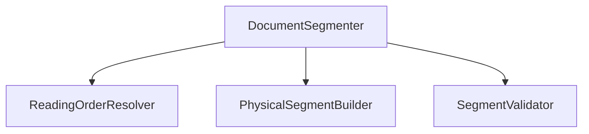
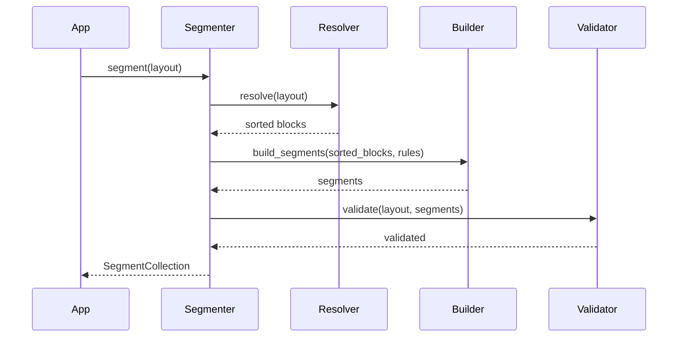

# Document Segmentation Design Document

**Version:** 1.0  
**Author:** Principal Software Engineer  
**Generated Date:** 2026-07-12  
**Related Handbook Chapter:** Book 02 — Document Processing  
**Related Milestone:** Milestone 2.3 — Document Segmentation & Reading Order  
**Status:** COMPLETE  

---

# Purpose

This document details the software design, pipelines, components, and validation schemas of the Document Segmentation layer.

---

# Scope

### Included:
- Reading order resolver sorting strategies.
- Size and page-boundary based physical segment builders.
- Structural validator checklists.
- Configuration parameters integration.

### Not Included:
- Section labeling (Education, Experience headers parsing) or parsing of text tokens.

---

# Background

Physical blocks must be grouped into manageable physical segments before entity extraction. To ensure reliability, we enforce natural reading order and strict checks to prevent block loss or duplication.

---

# Architecture

Follows Clean Architecture layers. The `DocumentSegmenter` operates as an orchestration facade over independent processing services.



---

# Components

- **ReadingOrderResolver:** Orders physical blocks sequentially (by page and line).
- **PhysicalSegmentBuilder:** Splits blocks into segments when character boundaries, page transitions, or block ranges exceed rule engine limits.
- **SegmentValidator:** Audits segments ensuring every block is represented exactly once without duplicates or sequence inversions.

---

# Public Interfaces

`DocumentSegmenter.segment(layout: DocumentLayout) -> SegmentCollection`

---

# Internal Components

- `DocumentSegment`: Holds raw lines, offsets, page details, and parent blocks.
- `SegmentCollection`: Contains list of segments in reading order.

---

# Data Flow

```
DocumentLayout → ReadingOrderResolver → PhysicalSegmentBuilder → SegmentValidator → SegmentCollection
```

---

# Sequence Flow



---

# Dependency Graph

Compiles with zero dependencies on Book 03 or Book 04.

---

# Design Decisions

- **Opaque IDs:** Opaque identifiers (`segment_0001`, `segment_0002`) are used to prevent leaking semantic interpretations.
- **No Semantic Ownership:** Physical segments are merely sequences of blocks grouped physically, leaving semantic classification to downstream layers.

---

# Validation

Validated via unit tests simulating layouts.

---

# Thread Safety

Processors are stateless, holding no instance data.

---

# Error Handling

Invalid segment structures raise `SegmentValidationError`.

---

# Performance Considerations

Processed in $O(N)$ linear time.

---

# Testing

Test file: `tests/unit/domain/test_document_segmentation.py`.

---

# Verification Results

All tests completed successfully.

---

# Assumptions

Layout lists track correct line numbers.

---

# Limitations

Supports vertical reading layouts only.

---

# Future Extension Points

Segmentation metrics can be adjusted dynamically via rule files.

---

# Traceability

Matches physical document guidelines in Book 02.

---

# Conclusion

Milestone 2.3 is complete and verified.
