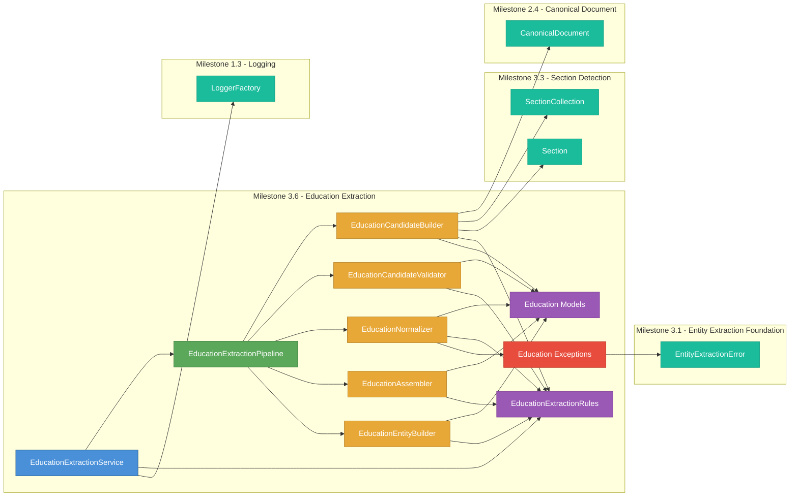

# Education Extraction Dependency Graph

## Book 03 — Entity Extraction | Milestone 3.6

```mermaid
graph LR
    subgraph "Milestone 3.6 - Education Extraction"
        SVC["EducationExtractionService"]
        PL["EducationExtractionPipeline"]
        CB["EducationCandidateBuilder"]
        CV["EducationCandidateValidator"]
        NR["EducationNormalizer"]
        AS["EducationAssembler"]
        EB["EducationEntityBuilder"]
        MD["Education Models"]
        RL["EducationExtractionRules"]
        EX["Education Exceptions"]
    end

    subgraph "Milestone 3.3 - Section Detection"
        SC["SectionCollection"]
        SE["Section"]
    end

    subgraph "Milestone 2.4 - Canonical Document"
        CD["CanonicalDocument"]
    end

    subgraph "Milestone 3.1 - Entity Extraction Foundation"
        EEX["EntityExtractionError"]
    end

    subgraph "Milestone 1.3 - Logging"
        LF["LoggerFactory"]
    end

    SVC --> PL
    SVC --> RL
    SVC --> LF
    PL --> CB
    PL --> CV
    PL --> NR
    PL --> AS
    PL --> EB
    CB --> CD
    CB --> SC
    CB --> SE
    CB --> RL
    CB --> MD
    CV --> MD
    CV --> RL
    NR --> MD
    NR --> RL
    NR --> EX
    AS --> MD
    AS --> RL
    EB --> MD
    EB --> RL
    EX --> EEX

    style SVC fill:#4a90d9,stroke:#2c5f8a,color:#fff
    style PL fill:#5ba85b,stroke:#3d7a3d,color:#fff
    style CB fill:#e8a838,stroke:#b8842c,color:#fff
    style CV fill:#e8a838,stroke:#b8842c,color:#fff
    style NR fill:#e8a838,stroke:#b8842c,color:#fff
    style AS fill:#e8a838,stroke:#b8842c,color:#fff
    style EB fill:#e8a838,stroke:#b8842c,color:#fff
    style MD fill:#9b59b6,stroke:#7d3c98,color:#fff
    style RL fill:#9b59b6,stroke:#7d3c98,color:#fff
    style EX fill:#e74c3c,stroke:#c0392b,color:#fff
    style SC fill:#1abc9c,stroke:#16a085,color:#fff
    style SE fill:#1abc9c,stroke:#16a085,color:#fff
    style CD fill:#1abc9c,stroke:#16a085,color:#fff
    style EEX fill:#1abc9c,stroke:#16a085,color:#fff
    style LF fill:#1abc9c,stroke:#16a085,color:#fff
```
