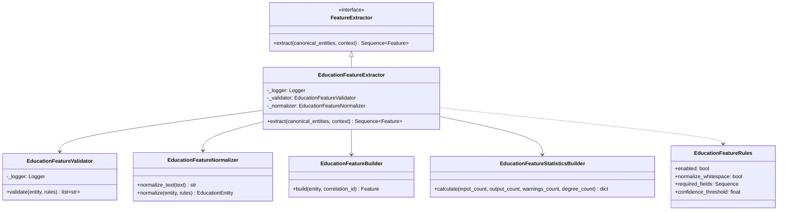

# Education Feature Engineering Class Diagram

## Book 04 — Feature Engineering | Milestone 4.4

The class diagram outlines the interfaces and helper classes supporting `EducationFeatureExtractor`:

