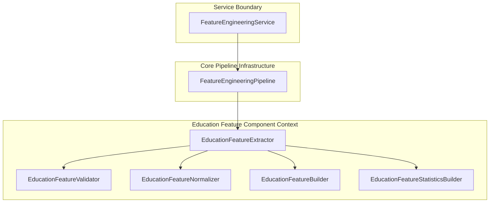

# Education Feature Engineering Component Diagram

## Book 04 — Feature Engineering | Milestone 4.4

The diagram maps the relationships of components within the Feature Extraction Layer:

```mermaid
graph TD
    subgraph "Service Boundary"
        Service["FeatureEngineeringService"]
    end

    subgraph "Education Feature Component Context"
        Extractor["EducationFeatureExtractor"]
        Validator["EducationFeatureValidator"]
        Normalizer["EducationFeatureNormalizer"]
        Builder["EducationFeatureBuilder"]
        Stats["EducationFeatureStatisticsBuilder"]
    end

    subgraph "Core Pipeline Infrastructure"
        Pipeline["FeatureEngineeringPipeline"]
    end

    Service --> Pipeline
    Pipeline --> Extractor
    Extractor --> Validator
    Extractor --> Normalizer
    Extractor --> Builder
    Extractor --> Stats
```
