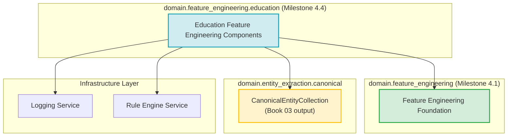

# Education Feature Engineering Dependency Graph

## Book 04 — Feature Engineering | Milestone 4.4

The dependency graph illustrates clean import structures and boundaries:

```mermaid
graph TD
    subgraph "domain.feature_engineering.education (Milestone 4.4)"
        EduFeature["Education Feature Engineering Components"]
    end

    subgraph "domain.feature_engineering (Milestone 4.1)"
        BaseFoundation["Feature Engineering Foundation"]
    end

    subgraph "domain.entity_extraction.canonical"
        CanonicalModels["CanonicalEntityCollection<br/>(Book 03 output)"]
    end

    subgraph "Infrastructure Layer"
        Logging["Logging Service"]
        RuleEngine["Rule Engine Service"]
    end

    EduFeature --> BaseFoundation
    EduFeature --> CanonicalModels
    EduFeature --> Logging
    EduFeature --> RuleEngine

    %% Style representations
    style EduFeature fill:#d1ecf1,stroke:#17a2b8,stroke-width:2px
    style BaseFoundation fill:#d4edda,stroke:#28a745,stroke-width:2px
    style CanonicalModels fill:#fff3cd,stroke:#ffc107,stroke-width:2px
```
