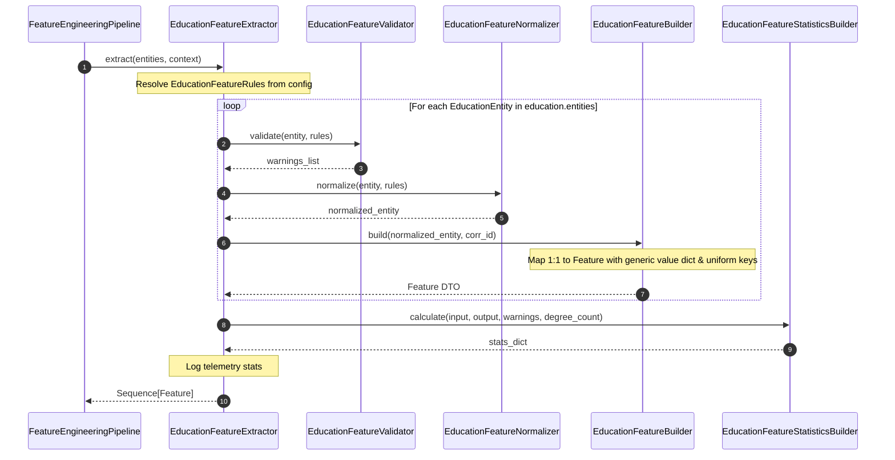

# Education Feature Engineering Sequence Diagram

## Book 04 — Feature Engineering | Milestone 4.4

The timeline sequence below depicts the execution flow during education feature extraction:

```mermaid
sequenceDiagram
    autonumber
    participant Pipeline as FeatureEngineeringPipeline
    participant Extractor as EducationFeatureExtractor
    participant Validator as EducationFeatureValidator
    participant Normalizer as EducationFeatureNormalizer
    participant Builder as EducationFeatureBuilder
    participant Stats as EducationFeatureStatisticsBuilder

    Pipeline ->> Extractor: extract(entities, context)
    Note over Extractor: Resolve EducationFeatureRules from config
    
    loop For each EducationEntity in education.entities
        Extractor ->> Validator: validate(entity, rules)
        Validator -->> Extractor: warnings_list
        Extractor ->> Normalizer: normalize(entity, rules)
        Normalizer -->> Extractor: normalized_entity
        Extractor ->> Builder: build(normalized_entity, corr_id)
        Note over Builder: Map 1:1 to Feature with generic value dict & uniform keys
        Builder -->> Extractor: Feature DTO
    end

    Extractor ->> Stats: calculate(input, output, warnings, degree_count)
    Stats -->> Extractor: stats_dict
    
    Note over Extractor: Log telemetry stats
    Extractor -->> Pipeline: Sequence[Feature]
```
