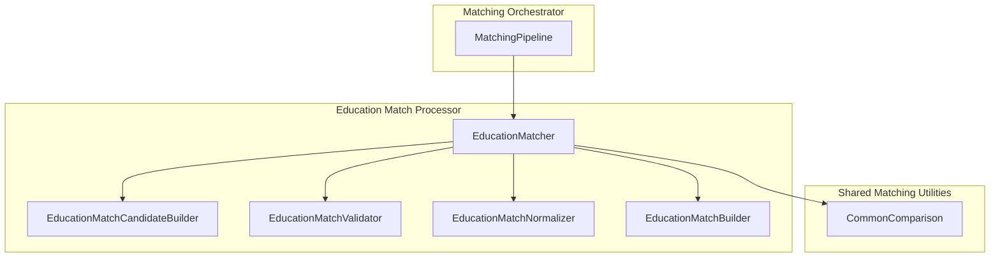

# Education Matching Component Diagram

## Book 05 — Matching Engine | Milestone 5.4

The structural layout shows components within the Education Match context:

```mermaid
graph TD
    subgraph "Matching Orchestrator"
        Pipeline["MatchingPipeline"]
    end

    subgraph "Education Match Processor"
        Matcher["EducationMatcher"]
        Candidate["EducationMatchCandidateBuilder"]
        Validator["EducationMatchValidator"]
        Normalizer["EducationMatchNormalizer"]
        Builder["EducationMatchBuilder"]
    end

    subgraph "Shared Matching Utilities"
        Common["CommonComparison"]
    end

    Pipeline --> Matcher
    Matcher --> Candidate
    Matcher --> Validator
    Matcher --> Normalizer
    Matcher --> Builder
    Matcher --> Common
```
