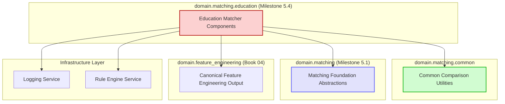

# Education Matching Dependency Graph

## Book 05 — Matching Engine | Milestone 5.4

The dependency graph details boundaries and dynamics under the Education segment matcher:

```mermaid
graph TD
    subgraph "domain.matching.education (Milestone 5.4)"
        EducationMatching["Education Matcher Components"]
    end

    subgraph "domain.matching.common"
        MatchingCommon["Common Comparison Utilities"]
    end

    subgraph "domain.matching (Milestone 5.1)"
        MatchingFoundation["Matching Foundation Abstractions"]
    end

    subgraph "domain.feature_engineering (Book 04)"
        CanonicalFeature["Canonical Feature Engineering Output"]
    end

    subgraph "Infrastructure Layer"
        Logging["Logging Service"]
        RuleEngine["Rule Engine Service"]
    end

    EducationMatching --> MatchingFoundation
    EducationMatching --> MatchingCommon
    EducationMatching --> CanonicalFeature
    EducationMatching --> Logging
    EducationMatching --> RuleEngine

    %% Style layouts
    style EducationMatching fill:#fcd1d1,stroke:#b81717,stroke-width:2px
    style MatchingCommon fill:#d1fcd1,stroke:#17b817,stroke-width:2px
    style MatchingFoundation fill:#e2e2fc,stroke:#5c5cfc,stroke-width:2px
```
