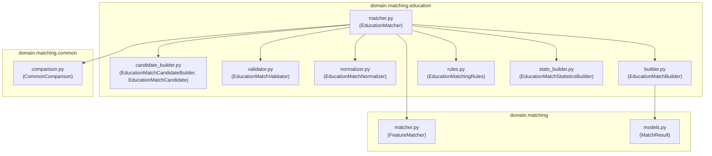

# Education Matching Package Diagram

## Book 05 — Matching Engine | Milestone 5.4

The package diagram details files organized under `matching/education/` and `matching/common/`:

```mermaid
graph TD
    subgraph "domain.matching.education"
        Matcher["matcher.py<br/>(EducationMatcher)"]
        Candidate["candidate_builder.py<br/>(EducationMatchCandidateBuilder, EducationMatchCandidate)"]
        Validator["validator.py<br/>(EducationMatchValidator)"]
        Normalizer["normalizer.py<br/>(EducationMatchNormalizer)"]
        Builder["builder.py<br/>(EducationMatchBuilder)"]
        Rules["rules.py<br/>(EducationMatchingRules)"]
        Stats["stats_builder.py<br/>(EducationMatchStatisticsBuilder)"]
    end

    subgraph "domain.matching.common"
        Common["comparison.py<br/>(CommonComparison)"]
    end

    subgraph "domain.matching"
        BaseMatcher["matcher.py<br/>(FeatureMatcher)"]
        Models["models.py<br/>(MatchResult)"]
    end

    Matcher --> BaseMatcher
    Matcher --> Candidate
    Matcher --> Validator
    Matcher --> Normalizer
    Matcher --> Builder
    Matcher --> Rules
    Matcher --> Stats
    Matcher --> Common
    Builder --> Models
```
