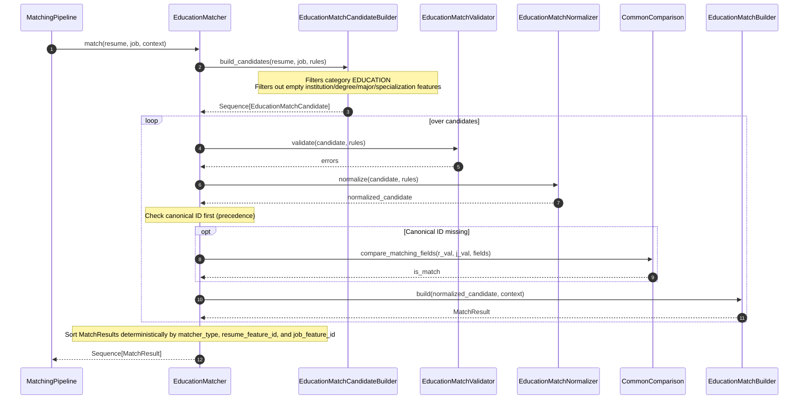

# Education Matching Sequence Diagram

## Book 05 — Matching Engine | Milestone 5.4

The sequence diagram details pipeline execution calls during Education feature comparisons:

```mermaid
sequenceDiagram
    autonumber
    participant Pipeline as MatchingPipeline
    participant Matcher as EducationMatcher
    participant Candidate as EducationMatchCandidateBuilder
    participant Validator as EducationMatchValidator
    participant Normalizer as EducationMatchNormalizer
    participant Common as CommonComparison
    participant Builder as EducationMatchBuilder

    Pipeline ->> Matcher: match(resume, job, context)
    Matcher ->> Candidate: build_candidates(resume, job, rules)
    Note over Candidate: Filters category EDUCATION<br/>Filters out empty institution/degree/major/specialization features
    Candidate -->> Matcher: Sequence[EducationMatchCandidate]
    Loop over candidates
        Matcher ->> Validator: validate(candidate, rules)
        Validator -->> Matcher: errors
        Matcher ->> Normalizer: normalize(candidate, rules)
        Normalizer -->> Matcher: normalized_candidate
        Note over Matcher: Check canonical ID first (precedence)
        Opt Canonical ID missing
            Matcher ->> Common: compare_matching_fields(r_val, j_val, fields)
            Common -->> Matcher: is_match
        End
        Matcher ->> Builder: build(normalized_candidate, context)
        Builder -->> Matcher: MatchResult
    End
    Note over Matcher: Sort MatchResults deterministically by matcher_type, resume_feature_id, and job_feature_id
    Matcher -->> Pipeline: Sequence[MatchResult]
```
