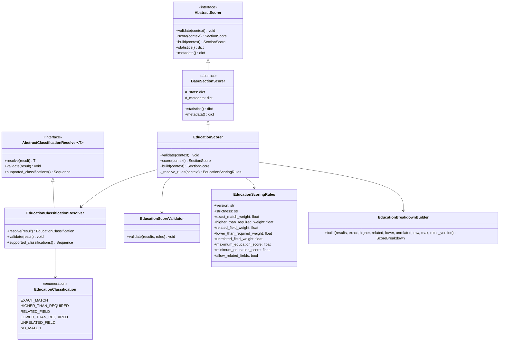

# Education Scorer Class Diagram

```mermaid
classDiagram
    direction TB
    class AbstractScorer {
        <<interface>>
        +validate(context) void
        +score(context) SectionScore
        +build(context) SectionScore
        +statistics() dict
        +metadata() dict
    }
    class BaseSectionScorer {
        <<abstract>>
        #_stats: dict
        #_metadata: dict
        +statistics() dict
        +metadata() dict
    }
    class EducationScorer {
        +validate(context) void
        +score(context) SectionScore
        +build(context) SectionScore
        -_resolve_rules(context) EducationScoringRules
    }
    class AbstractClassificationResolver~T~ {
        <<interface>>
        +resolve(result) T
        +validate(result) void
        +supported_classifications() Sequence
    }
    class EducationClassificationResolver {
        +resolve(result) EducationClassification
        +validate(result) void
        +supported_classifications() Sequence
    }
    class EducationClassification {
        <<enumeration>>
        EXACT_MATCH
        HIGHER_THAN_REQUIRED
        RELATED_FIELD
        LOWER_THAN_REQUIRED
        UNRELATED_FIELD
        NO_MATCH
    }
    class EducationScoreValidator {
        +validate(results, rules) void
    }
    class EducationScoringRules {
        +version: str
        +strictness: str
        +exact_match_weight: float
        +higher_than_required_weight: float
        +related_field_weight: float
        +lower_than_required_weight: float
        +unrelated_field_weight: float
        +maximum_education_score: float
        +minimum_education_score: float
        +allow_related_fields: bool
    }
    class EducationBreakdownBuilder {
        +build(results, exact, higher, related, lower, unrelated, raw, max, rules_version) ScoreBreakdown
    }

    AbstractScorer <|-- BaseSectionScorer
    BaseSectionScorer <|-- EducationScorer
    AbstractClassificationResolver <|-- EducationClassificationResolver
    EducationScorer --> EducationClassificationResolver
    EducationScorer --> EducationScoreValidator
    EducationScorer --> EducationScoringRules
    EducationScorer --> EducationBreakdownBuilder
    EducationClassificationResolver --> EducationClassification
```
