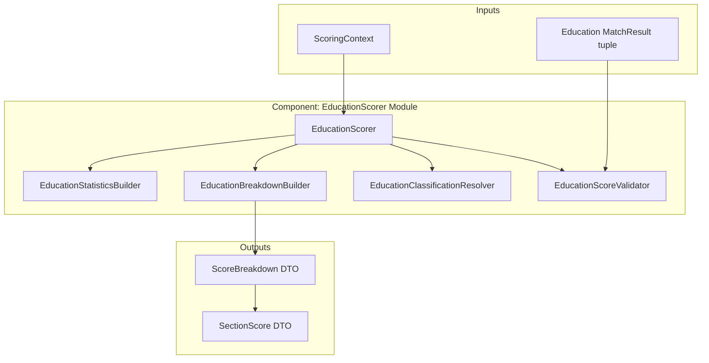

# Education Scorer Component Diagram

```mermaid
graph TD
    subgraph Component: EducationScorer Module
        Scorer[EducationScorer]
        Resolver[EducationClassificationResolver]
        Validator[EducationScoreValidator]
        BreakdownBuilder[EducationBreakdownBuilder]
        StatsBuilder[EducationStatisticsBuilder]
    end

    subgraph Inputs
        Context[ScoringContext]
        Results[Education MatchResult tuple]
    end

    subgraph Outputs
        Breakdown[ScoreBreakdown DTO]
        SecScore[SectionScore DTO]
    end

    Context --> Scorer
    Results --> Validator
    Scorer --> Validator
    Scorer --> Resolver
    Scorer --> BreakdownBuilder
    Scorer --> StatsBuilder
    BreakdownBuilder --> Breakdown
    Breakdown --> SecScore
```
