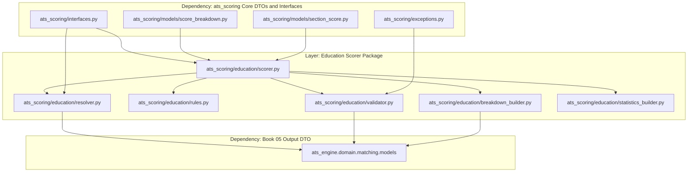

# Education Scorer Dependency Graph

```mermaid
graph TD
    subgraph Layer: Education Scorer Package
        ats_scoring/education/scorer.py --> ats_scoring/education/resolver.py
        ats_scoring/education/scorer.py --> ats_scoring/education/rules.py
        ats_scoring/education/scorer.py --> ats_scoring/education/validator.py
        ats_scoring/education/scorer.py --> ats_scoring/education/breakdown_builder.py
        ats_scoring/education/scorer.py --> ats_scoring/education/statistics_builder.py
    end

    subgraph Dependency: ats_scoring Core DTOs and Interfaces
        ats_scoring/exceptions.py --> ats_scoring/education/validator.py
        ats_scoring/interfaces.py --> ats_scoring/education/scorer.py
        ats_scoring/interfaces.py --> ats_scoring/education/resolver.py
        ats_scoring/models/score_breakdown.py & ats_scoring/models/section_score.py --> ats_scoring/education/scorer.py
    end

    subgraph Dependency: Book 05 Output DTO
        matching/models.py[ats_engine.domain.matching.models]
    end

    ats_scoring/education/resolver.py & ats_scoring/education/validator.py & ats_scoring/education/breakdown_builder.py --> matching/models.py
```
