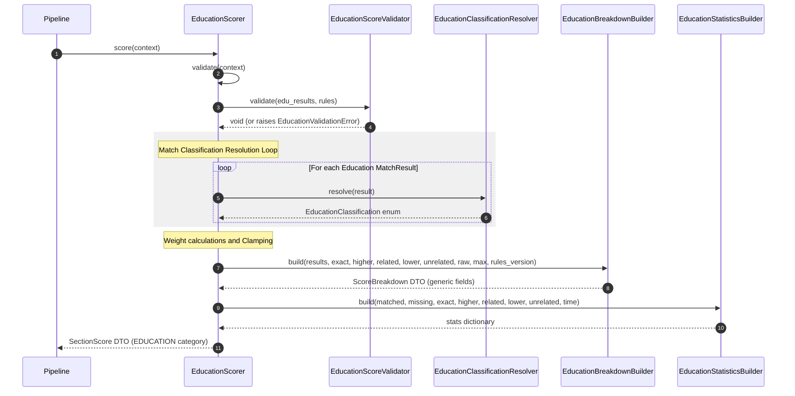

# Education Scorer Sequence Diagram

```mermaid
sequenceDiagram
    autonumber
    Pipeline ->> EducationScorer: score(context)
    EducationScorer ->> EducationScorer: validate(context)
    EducationScorer ->> EducationScoreValidator: validate(edu_results, rules)
    EducationScoreValidator -->> EducationScorer: void (or raises EducationValidationError)
    
    rect rgb(240, 240, 240)
        note over EducationScorer: Match Classification Resolution Loop
        loop For each Education MatchResult
            EducationScorer ->> EducationClassificationResolver: resolve(result)
            EducationClassificationResolver -->> EducationScorer: EducationClassification enum
        end
    end
    
    note over EducationScorer: Weight calculations and Clamping
    EducationScorer ->> EducationBreakdownBuilder: build(results, exact, higher, related, lower, unrelated, raw, max, rules_version)
    EducationBreakdownBuilder -->> EducationScorer: ScoreBreakdown DTO (generic fields)
    
    EducationScorer ->> EducationStatisticsBuilder: build(matched, missing, exact, higher, related, lower, unrelated, time)
    EducationStatisticsBuilder -->> EducationScorer: stats dictionary
    
    EducationScorer -->> Pipeline: SectionScore DTO (EDUCATION category)
```
