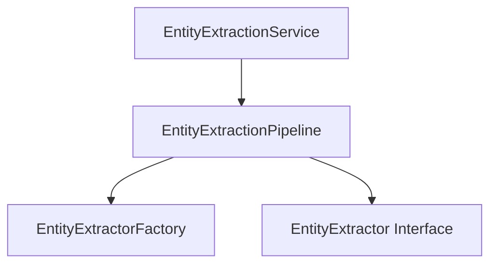
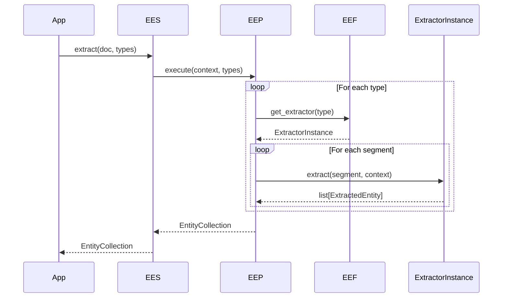

# Entity Extraction Foundation Design Document

**Version:** 1.0  
**Author:** Principal Software Engineer  
**Generated Date:** 2026-07-12  
**Related Handbook Chapter:** Book 03 — Entity Extraction  
**Related Milestone:** Milestone 3.1 — Entity Extraction Foundation  
**Status:** COMPLETE  

---

# Purpose

This document details the software design, sequence, registry mapping patterns, and pipelines for the Entity Extraction Foundation.

---

# Scope

### Included:
- Registry mapping and factory instantiations.
- Segment-level pipeline iteration loop.
- Context data contracts.
- Model schemas.

### Not Included:
- Domain NLP parsing rules.

---

# Background

Extracting information (skills, experience ranges, degrees) requires an extensible architecture where individual extractors can be wired and executed statelessly over segments without tight coupling.

---

# Architecture

Stateless design utilizing independent single-purpose processors.



---

# Components

- **EntityExtractorRegistry:** Class reference index.
- **EntityExtractorFactory:** Object resolver.
- **EntityExtractionPipeline:** Processor driving the iteration loops.
- **EntityExtractionService:** Entry orchestrator.

---

# Public Interfaces

`EntityExtractionService.extract(document, extractor_types, config, correlation_id) -> EntityCollection`

---

# Internal Components

- `EntityExtractionContext`: Aggregates active configs.
- `EntityCollection`: Packaging contract.

---

# Data Flow

```
CanonicalDocument → Segment Loop → Extractor Extraction → Statistics → EntityCollection
```

---

# Sequence Flow



---

# Dependency Graph

Depends only on Book 02 models (`CanonicalDocument`, `DocumentSegment`).

---

# Design Decisions

- **Independent Extractors:** Extractors are fully standalone with zero inter-dependencies to ensure concurrent reliability.
- **Read-Only Context:** Context objects are immutable to prevent extractors from passing state changes or caching values.

---

# Validation

Validated via unit tests simulating extraction runs.

---

# Thread Safety

Every extractor has zero shared state or instance properties.

---

# Error Handling

Explicit domain exceptions are raised: `ExtractorRegistrationError`, `UnknownExtractorError`, `PipelineExecutionError`.

---

# Performance Considerations

Runs in $O(E \times S)$ time where $E$ is count of active extractors and $S$ is segment count.

---

# Testing

Test file: `tests/unit/domain/test_entity_extraction.py`.

---

# Verification Results

All tests completed successfully.

---

# Assumptions

Segment texts are normalized and valid.

---

# Limitations

Context properties are immutable during execution.

---

# Future Extension Points

Extractors for specific entities can be wired into the registry.

---

# Traceability

Satisfies Entity Extraction framework guidelines.

---

# Conclusion

Milestone 3.1 is complete and verified.
