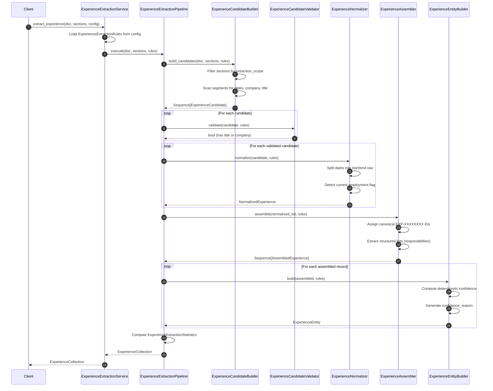

# Experience Extraction Sequence Diagram

## Book 03 — Entity Extraction | Milestone 3.5

```mermaid
sequenceDiagram
    autonumber
    participant Client
    participant Service as ExperienceExtractionService
    participant Pipeline as ExperienceExtractionPipeline
    participant Builder as ExperienceCandidateBuilder
    participant Validator as ExperienceCandidateValidator
    participant Normalizer as ExperienceNormalizer
    participant Assembler as ExperienceAssembler
    participant EntityBuilder as ExperienceEntityBuilder

    Client->>Service: extract_experience(doc, sections, config)
    Service->>Service: Load ExperienceExtractionRules from config
    Service->>Pipeline: execute(doc, sections, rules)

    Pipeline->>Builder: build_candidates(doc, sections, rules)
    Builder->>Builder: Filter sections by extraction_scope
    Builder->>Builder: Scan segments for dates, company, title
    Builder-->>Pipeline: Sequence[ExperienceCandidate]

    loop For each candidate
        Pipeline->>Validator: validate(candidate, rules)
        Validator-->>Pipeline: bool (has title or company)
    end

    loop For each validated candidate
        Pipeline->>Normalizer: normalize(candidate, rules)
        Normalizer->>Normalizer: Split dates into start/end raw
        Normalizer->>Normalizer: Detect current employment flag
        Normalizer-->>Pipeline: NormalizedExperience
    end

    Pipeline->>Assembler: assemble(normalized_list, rules)
    Assembler->>Assembler: Assign canonical EXP-XXXXXXXX IDs
    Assembler->>Assembler: Extract structured lists (responsibilities)
    Assembler-->>Pipeline: Sequence[AssembledExperience]

    loop For each assembled record
        Pipeline->>EntityBuilder: build(assembled, rules)
        EntityBuilder->>EntityBuilder: Compute deterministic confidence
        EntityBuilder->>EntityBuilder: Generate confidence_reason
        EntityBuilder-->>Pipeline: ExperienceEntity
    end

    Pipeline->>Pipeline: Compute ExperienceExtractionStatistics
    Pipeline-->>Service: ExperienceCollection
    Service-->>Client: ExperienceCollection
```
