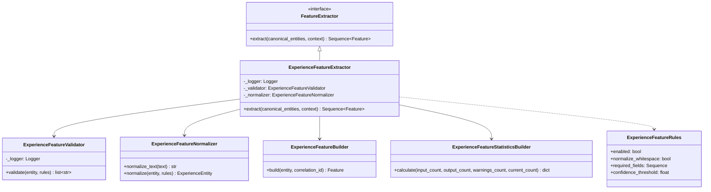

# Experience Feature Engineering Class Diagram

## Book 04 — Feature Engineering | Milestone 4.3

The class diagram outlines the interfaces and helper classes supporting `ExperienceFeatureExtractor`:

