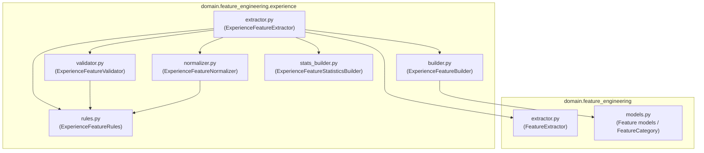

# Experience Feature Engineering Package Diagram

## Book 04 — Feature Engineering | Milestone 4.3

The package boundary view details the files organized inside the `experience` sub-directory:

```mermaid
graph TD
    subgraph "domain.feature_engineering.experience"
        Extractor["extractor.py<br/>(ExperienceFeatureExtractor)"]
        Validator["validator.py<br/>(ExperienceFeatureValidator)"]
        Normalizer["normalizer.py<br/>(ExperienceFeatureNormalizer)"]
        Builder["builder.py<br/>(ExperienceFeatureBuilder)"]
        Stats["stats_builder.py<br/>(ExperienceFeatureStatisticsBuilder)"]
        Rules["rules.py<br/>(ExperienceFeatureRules)"]
    end

    subgraph "domain.feature_engineering"
        BaseExtractor["extractor.py<br/>(FeatureExtractor)"]
        BaseModels["models.py<br/>(Feature models / FeatureCategory)"]
    end

    Extractor --> BaseExtractor
    Extractor --> Validator
    Extractor --> Normalizer
    Extractor --> Builder
    Extractor --> Stats
    Extractor --> Rules

    Builder --> BaseModels
    Validator --> Rules
    Normalizer --> Rules
```
