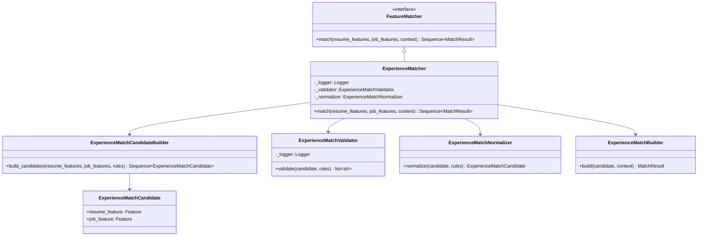

# Experience Matching Class Diagram

## Book 05 — Matching Engine | Milestone 5.3

The class diagram outlines interfaces and helper classes supporting `ExperienceMatcher`:

```mermaid
classDiagram
    class FeatureMatcher {
        <<interface>>
        +match(resume_features, job_features, context) Sequence~MatchResult~
    }

    class ExperienceMatcher {
        -_logger: Logger
        -_validator: ExperienceMatchValidator
        -_normalizer: ExperienceMatchNormalizer
        +match(resume_features, job_features, context) Sequence~MatchResult~
    }

    class ExperienceMatchCandidateBuilder {
        +build_candidates(resume_features, job_features, rules) Sequence~ExperienceMatchCandidate~
    }

    class ExperienceMatchCandidate {
        +resume_feature: Feature
        +job_feature: Feature
    }

    class ExperienceMatchValidator {
        -_logger: Logger
        +validate(candidate, rules) list~str~
    }

    class ExperienceMatchNormalizer {
        +normalize(candidate, rules) ExperienceMatchCandidate
    }

    class ExperienceMatchBuilder {
        +build(candidate, context) MatchResult
    }

    FeatureMatcher <|-- ExperienceMatcher
    ExperienceMatcher --> ExperienceMatchCandidateBuilder
    ExperienceMatcher --> ExperienceMatchValidator
    ExperienceMatcher --> ExperienceMatchNormalizer
    ExperienceMatcher --> ExperienceMatchBuilder
    ExperienceMatchCandidateBuilder --> ExperienceMatchCandidate
```
