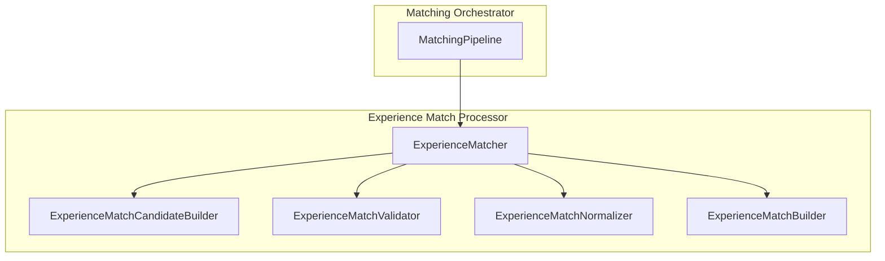

# Experience Matching Component Diagram

## Book 05 — Matching Engine | Milestone 5.3

The component architecture details dependencies within the Experience Match context:

```mermaid
graph TD
    subgraph "Matching Orchestrator"
        Pipeline["MatchingPipeline"]
    end

    subgraph "Experience Match Processor"
        Matcher["ExperienceMatcher"]
        Candidate["ExperienceMatchCandidateBuilder"]
        Validator["ExperienceMatchValidator"]
        Normalizer["ExperienceMatchNormalizer"]
        Builder["ExperienceMatchBuilder"]
    end

    Pipeline --> Matcher
    Matcher --> Candidate
    Matcher --> Validator
    Matcher --> Normalizer
    Matcher --> Builder
```
