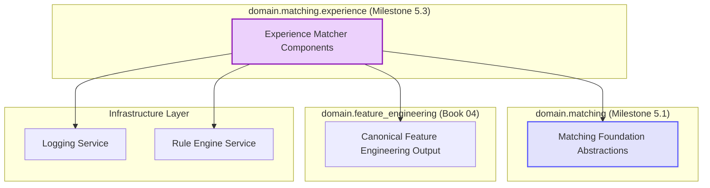

# Experience Matching Dependency Graph

## Book 05 — Matching Engine | Milestone 5.3

The dependency graph details boundaries and dynamics under the Experience segment matcher:

```mermaid
graph TD
    subgraph "domain.matching.experience (Milestone 5.3)"
        ExperienceMatching["Experience Matcher Components"]
    end

    subgraph "domain.matching (Milestone 5.1)"
        MatchingFoundation["Matching Foundation Abstractions"]
    end

    subgraph "domain.feature_engineering (Book 04)"
        CanonicalFeature["Canonical Feature Engineering Output"]
    end

    subgraph "Infrastructure Layer"
        Logging["Logging Service"]
        RuleEngine["Rule Engine Service"]
    end

    ExperienceMatching --> MatchingFoundation
    ExperienceMatching --> CanonicalFeature
    ExperienceMatching --> Logging
    ExperienceMatching --> RuleEngine

    %% Style layouts
    style ExperienceMatching fill:#ecd1fc,stroke:#8e17b8,stroke-width:2px
    style MatchingFoundation fill:#e2e2fc,stroke:#5c5cfc,stroke-width:2px
```
