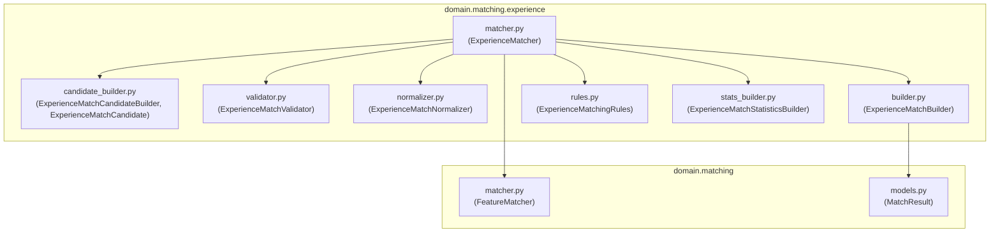

# Experience Matching Package Diagram

## Book 05 — Matching Engine | Milestone 5.3

The package layout details files organized under `matching/experience/`:

```mermaid
graph TD
    subgraph "domain.matching.experience"
        Matcher["matcher.py<br/>(ExperienceMatcher)"]
        Candidate["candidate_builder.py<br/>(ExperienceMatchCandidateBuilder, ExperienceMatchCandidate)"]
        Validator["validator.py<br/>(ExperienceMatchValidator)"]
        Normalizer["normalizer.py<br/>(ExperienceMatchNormalizer)"]
        Builder["builder.py<br/>(ExperienceMatchBuilder)"]
        Rules["rules.py<br/>(ExperienceMatchingRules)"]
        Stats["stats_builder.py<br/>(ExperienceMatchStatisticsBuilder)"]
    end

    subgraph "domain.matching"
        BaseMatcher["matcher.py<br/>(FeatureMatcher)"]
        Models["models.py<br/>(MatchResult)"]
    end

    Matcher --> BaseMatcher
    Matcher --> Candidate
    Matcher --> Validator
    Matcher --> Normalizer
    Matcher --> Builder
    Matcher --> Rules
    Matcher --> Stats
    Builder --> Models
```
