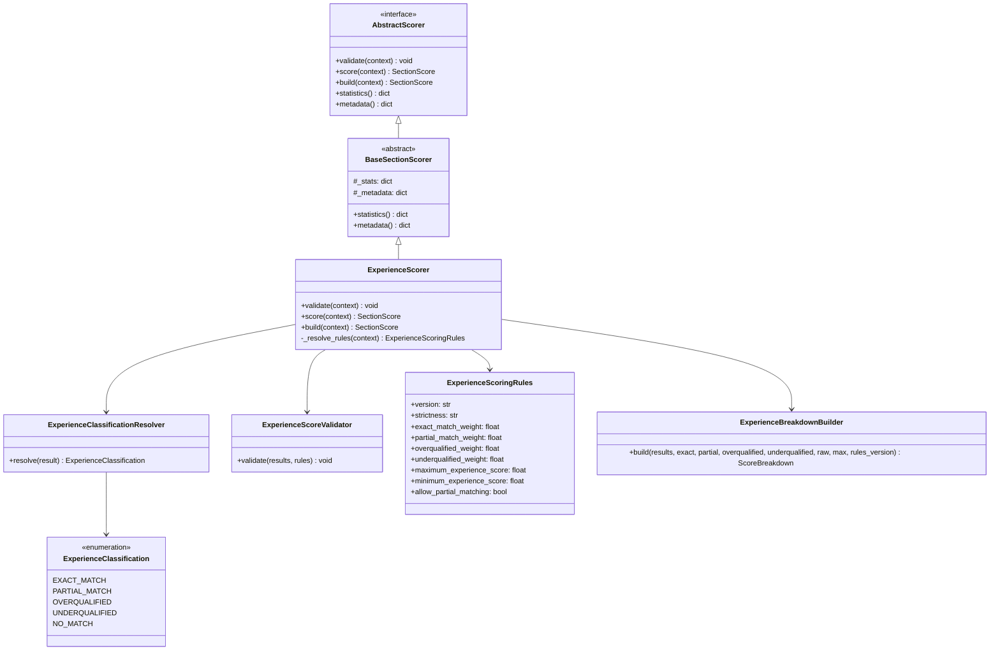

# Experience Scorer Class Diagram

```mermaid
classDiagram
    direction TB
    class AbstractScorer {
        <<interface>>
        +validate(context) void
        +score(context) SectionScore
        +build(context) SectionScore
        +statistics() dict
        +metadata() dict
    }
    class BaseSectionScorer {
        <<abstract>>
        #_stats: dict
        #_metadata: dict
        +statistics() dict
        +metadata() dict
    }
    class ExperienceScorer {
        +validate(context) void
        +score(context) SectionScore
        +build(context) SectionScore
        -_resolve_rules(context) ExperienceScoringRules
    }
    class ExperienceClassificationResolver {
        +resolve(result) ExperienceClassification
    }
    class ExperienceClassification {
        <<enumeration>>
        EXACT_MATCH
        PARTIAL_MATCH
        OVERQUALIFIED
        UNDERQUALIFIED
        NO_MATCH
    }
    class ExperienceScoreValidator {
        +validate(results, rules) void
    }
    class ExperienceScoringRules {
        +version: str
        +strictness: str
        +exact_match_weight: float
        +partial_match_weight: float
        +overqualified_weight: float
        +underqualified_weight: float
        +maximum_experience_score: float
        +minimum_experience_score: float
        +allow_partial_matching: bool
    }
    class ExperienceBreakdownBuilder {
        +build(results, exact, partial, overqualified, underqualified, raw, max, rules_version) ScoreBreakdown
    }

    AbstractScorer <|-- BaseSectionScorer
    BaseSectionScorer <|-- ExperienceScorer
    ExperienceScorer --> ExperienceClassificationResolver
    ExperienceScorer --> ExperienceScoreValidator
    ExperienceScorer --> ExperienceScoringRules
    ExperienceScorer --> ExperienceBreakdownBuilder
    ExperienceClassificationResolver --> ExperienceClassification
```
