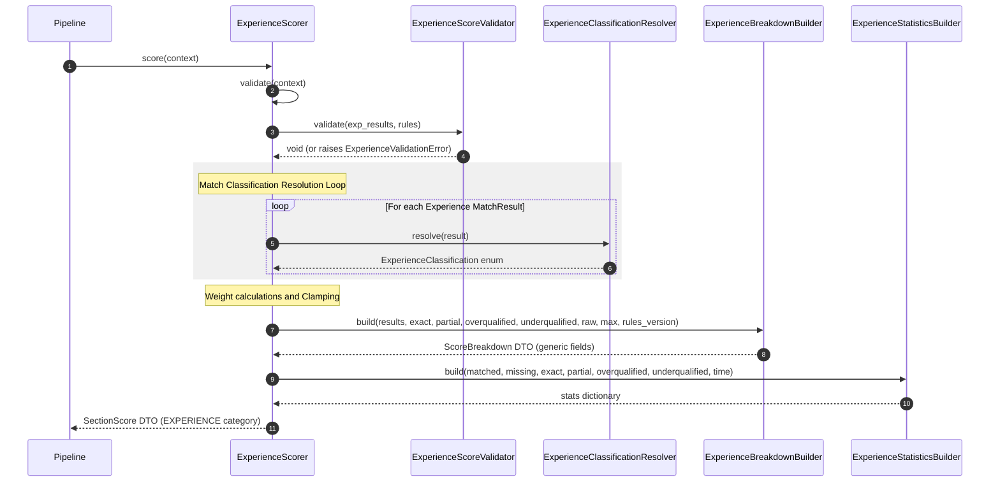

# Experience Scorer Sequence Diagram

```mermaid
sequenceDiagram
    autonumber
    Pipeline ->> ExperienceScorer: score(context)
    ExperienceScorer ->> ExperienceScorer: validate(context)
    ExperienceScorer ->> ExperienceScoreValidator: validate(exp_results, rules)
    ExperienceScoreValidator -->> ExperienceScorer: void (or raises ExperienceValidationError)
    
    rect rgb(240, 240, 240)
        note over ExperienceScorer: Match Classification Resolution Loop
        loop For each Experience MatchResult
            ExperienceScorer ->> ExperienceClassificationResolver: resolve(result)
            ExperienceClassificationResolver -->> ExperienceScorer: ExperienceClassification enum
        end
    end
    
    note over ExperienceScorer: Weight calculations and Clamping
    ExperienceScorer ->> ExperienceBreakdownBuilder: build(results, exact, partial, overqualified, underqualified, raw, max, rules_version)
    ExperienceBreakdownBuilder -->> ExperienceScorer: ScoreBreakdown DTO (generic fields)
    
    ExperienceScorer ->> ExperienceStatisticsBuilder: build(matched, missing, exact, partial, overqualified, underqualified, time)
    ExperienceStatisticsBuilder -->> ExperienceScorer: stats dictionary
    
    ExperienceScorer -->> Pipeline: SectionScore DTO (EXPERIENCE category)
```
