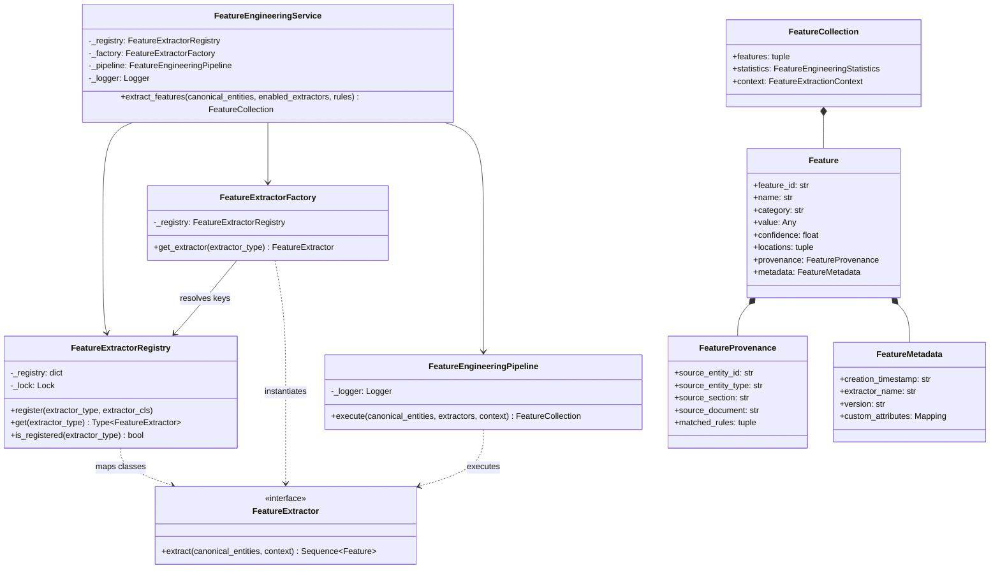

# Feature Engineering Foundation Class Diagram

## Book 04 — Feature Engineering | Milestone 4.1

The UML class diagram below details the structural mappings, dependencies, and relations in the Feature Engineering Foundation package:

